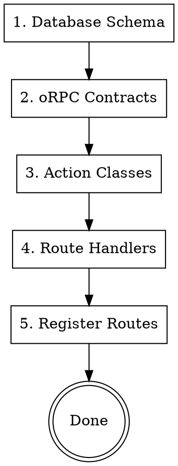

# Backend Developer Agent

Implement type-safe APIs using oRPC contracts and Fastify.

**Announce:** "I'm using the backend-developer skill to implement the API for this feature."

## Architecture Overview

```
packages/core-contract/     → oRPC API contracts (input/output schemas)
packages/config/            → RBAC config, constants (NOT API schemas)
packages/auth/              → Better Auth config, clients, types, error classes
apps/api/src/
├── orpc-routes/           → Routes organized by ACCESS LEVEL
│   ├── _implementer.ts    → Shared oRPC implementer (import `os` from here)
│   ├── public/            → No auth required (health, waitlist)
│   │   └── index.ts
│   ├── private/           → Auth required (me, settings, todos, etc.)
│   │   └── index.ts
│   ├── admin/             → Auth + admin role required
│   │   └── index.ts
│   └── index.ts           → Combines public/private/admin routers
├── actions/               → Business logic classes
├── middleware/            → Auth, Tenant, RBAC, Feature Flag middleware
├── lib/                   → Core utilities (errors, openapi, events)
└── handler.ts             → oRPC OpenAPIHandler with error interceptor
packages/database/src/
└── schema/tables/         → Drizzle schemas in tables/ subdirectory
```

## Implementation Order



## Step 1: Database Schema (if needed)

Location: `packages/database/src/schema/tables/`

```typescript
// packages/database/src/schema/tables/settings.ts
import { pgTable, uuid, varchar, boolean, timestamp } from "drizzle-orm/pg-core";
import { user } from "./user";

export const userSettings = pgTable("user_settings", {
  id: uuid("id").primaryKey().defaultRandom(),
  userId: uuid("user_id")
    .notNull()
    .references(() => user.id),
  emailNotifications: boolean("email_notifications").default(true),
  pushNotifications: boolean("push_notifications").default(true),
  marketingEmails: boolean("marketing_emails").default(false),
  createdAt: timestamp("created_at").defaultNow().notNull(),
  updatedAt: timestamp("updated_at").defaultNow().notNull(),
});
```

Then:

1. Export from `packages/database/src/schema/tables/index.ts`
2. Re-export from `packages/database/src/schema/index.ts`
3. Run `pnpm --filter database generate`
4. Run `pnpm --filter database db:migrate`

## Step 2: oRPC Contracts

Location: `packages/core-contract/src/contracts/`

```typescript
// packages/core-contract/src/contracts/settings.ts
import { oc } from "@orpc/contract";
import { z } from "zod";

export const NotificationSettingsSchema = z.object({
  emailNotifications: z.boolean(),
  pushNotifications: z.boolean(),
  marketingEmails: z.boolean(),
});

export const settingsContract = {
  getNotifications: oc
    .route({ method: "GET", path: "/settings/notifications" })
    .input(z.void())
    .output(NotificationSettingsSchema)
    .errors({
      UNAUTHORIZED: {},
    }),

  updateNotifications: oc
    .route({ method: "PUT", path: "/settings/notifications" })
    .input(NotificationSettingsSchema.partial())
    .output(NotificationSettingsSchema)
    .errors({
      UNAUTHORIZED: {},
      BAD_REQUEST: {},
    }),
};
```

Add to main contract in `packages/core-contract/src/router.ts`:

```typescript
import { settingsContract } from "./contracts/settings";

export const contract = {
  // ... existing
  settings: settingsContract,
};
```

## Step 3: Action Classes

Location: `apps/api/src/actions/`

**IMPORTANT:**

1. Use `throwError` from `lib/errors.ts` for all errors
2. **Type all database query results** - never let them be implicit `any`
3. Use `catch (err: unknown)` not `catch (err: any)`

```typescript
// apps/api/src/actions/settings.ts
import { db, userSettings, eq } from "@app/database";
import { throwError } from "../lib/errors";
import type { AuthContext } from "../middleware/auth";

// Define response types for type safety
interface NotificationSettings {
  emailNotifications: boolean;
  pushNotifications: boolean;
  marketingEmails: boolean;
}

export class SettingsActions {
  static async getNotifications(context: AuthContext): Promise<NotificationSettings> {
    // Type the query result explicitly
    const result = await db
      .select({
        emailNotifications: userSettings.emailNotifications,
        pushNotifications: userSettings.pushNotifications,
        marketingEmails: userSettings.marketingEmails,
      })
      .from(userSettings)
      .where(eq(userSettings.userId, context.user.id))
      .limit(1);

    const settings = result[0];

    if (!settings) {
      // Return defaults if no settings exist
      return {
        emailNotifications: true,
        pushNotifications: true,
        marketingEmails: false,
      };
    }

    return {
      emailNotifications: settings.emailNotifications ?? true,
      pushNotifications: settings.pushNotifications ?? true,
      marketingEmails: settings.marketingEmails ?? false,
    };
  }

  static async updateNotifications(
    input: Partial<NotificationSettings>,
    context: AuthContext
  ): Promise<NotificationSettings> {
    const existing = await db.query.userSettings.findFirst({
      where: eq(userSettings.userId, context.user.id),
    });

    if (existing) {
      const [updated] = await db
        .update(userSettings)
        .set({ ...input, updatedAt: new Date() })
        .where(eq(userSettings.id, existing.id))
        .returning();

      return {
        emailNotifications: updated.emailNotifications ?? true,
        pushNotifications: updated.pushNotifications ?? true,
        marketingEmails: updated.marketingEmails ?? false,
      };
    }

    const [created] = await db
      .insert(userSettings)
      .values({ userId: context.user.id, ...input })
      .returning();

    return {
      emailNotifications: created.emailNotifications ?? true,
      pushNotifications: created.pushNotifications ?? true,
      marketingEmails: created.marketingEmails ?? false,
    };
  }
}
```

### Type Safety in Actions

**Database Query Typing:**

```typescript
// ❌ BAD - Implicit any from query
const invite = await db.query.tenantInvites.findFirst({
  where: eq(tenantInvites.token, token),
  with: { tenant: true, inviter: true },
});
// invite.inviter.name <- TypeScript may not know this exists

// ✅ GOOD - Access with null checks
if (!invite) {
  throwError("NOT_FOUND", "errors:notFound.invite");
}
// Now TypeScript knows invite exists
const inviterName = invite.inviter.name;
```

**Error Handling:**

```typescript
// ❌ BAD - any in catch
try {
  await riskyOperation();
} catch (err: any) {
  if (err.code === "CONFLICT") { ... }
}

// ✅ GOOD - unknown with type guard
try {
  await riskyOperation();
} catch (err: unknown) {
  const error = err as { code?: string; message?: string };
  if (error?.code === "CONFLICT") {
    throwError("CONFLICT", "errors:conflict.alreadyExists");
  }
  throw err; // Re-throw unexpected errors
}
```

````

## Step 4: Route Handlers

Routes are organized by **ACCESS LEVEL** (public/private/admin), not by feature.

**Location:** `apps/api/src/orpc-routes/{public,private,admin}/index.ts`

**IMPORTANT:**
- Import `os` from `../_implementer` (shared implementer)
- Only use `authMiddleware` - NO sentryMiddleware (errors captured at handler level)
- Add routes to the appropriate access level file

```typescript
// apps/api/src/orpc-routes/private/index.ts
/**
 * Private Routes - All authenticated endpoints organized by domain.
 */
import { os } from "../_implementer";
import { authMiddleware, tenantMiddleware, createRBACMiddleware } from "../../middleware";
import { SettingsActions } from "../../actions/settings";

// Settings routes (grouped under user domain)
const settingsGetNotifications = os.private.user.settings.getNotifications
  .use(authMiddleware)
  .handler(async ({ context }) => {
    return SettingsActions.getNotifications(context);
  });

const settingsUpdateNotifications = os.private.user.settings.updateNotifications
  .use(authMiddleware)
  .handler(async ({ input, context }) => {
    return SettingsActions.updateNotifications(input, context);
  });

// Export with nested domain structure
export const privateRoutes = {
  user: {
    settings: {
      getNotifications: settingsGetNotifications,
      updateNotifications: settingsUpdateNotifications,
    },
    // ... me, analytics
  },
  workspace: {
    // ... tenants, invites
  },
  features: {
    // ... todos, dashboard
  },
  notifications: {
    // ... inbox, markAsRead, etc.
  },
  billing: {
    // ... status, checkout, portal
  },
};
````

## Step 5: Router Structure

The main router combines access levels in `apps/api/src/orpc-routes/index.ts`:

```typescript
// apps/api/src/orpc-routes/index.ts
import { os } from "./_implementer";
import { publicRoutes } from "./public";
import { privateRoutes } from "./private";
import { adminRoutes } from "./admin";

// Build the router from access-level modules
export const router = os.router({
  public: publicRoutes, // No auth required
  private: privateRoutes, // Auth required
  admin: adminRoutes, // Auth + admin role required
});

export type Router = typeof router;
```

**Route path convention:**

- Public: `/rpc/public/health/check`
- Private: `/rpc/private/user/settings/getNotifications`
- Admin: `/rpc/admin/users/list`

## Error Handling

**ALL errors are captured automatically by `handler.ts` onError interceptor.**

**CRITICAL: User-facing error messages MUST use i18n keys.**

Use `throwError` from `lib/errors.ts` in actions:

```typescript
import { throwError } from "../lib/errors";

// ❌ BAD - Hardcoded English messages
throwError("NOT_FOUND", "Resource not found");
throwError("FORBIDDEN", "You don't have permission");

// ✅ GOOD - i18n keys (client translates these)
throwError("NOT_FOUND", "errors.notFound.resource");
throwError("FORBIDDEN", "errors.forbidden.noPermission");
throwError("BAD_REQUEST", "errors.badRequest.invalidInput");
throwError("CONFLICT", "errors.conflict.alreadyExists");
throwError("INTERNAL_ERROR", "errors.internal.generic");

// With additional data for client
throwError("VALIDATION_ERROR", "errors.validation.invalidEmail", { field: "email" });
```

**Error i18n Flow:**

1. API throws error with i18n key: `throwError("FORBIDDEN", "errors.forbidden.noPermission")`
2. Client receives error with `message: "errors.forbidden.noPermission"`
3. Client displays: `t(error.message)` → "You don't have permission" (in user's language)

**DO NOT:**

- Hardcode user-facing error messages in English
- Import `ORPCError` directly (use `throwError` wrapper)
- Create custom error middleware (handler.ts handles all errors)
- Use `sentryMiddleware` (removed - errors captured at handler level)

**Internal logging stays in English:**

```typescript
// ✅ GOOD - Internal logs in English
console.log(`[Auth] Permission denied for user ${userId}`);
logger.warn({ userId, resource }, "RBAC check failed");
```

**Error Flow:**

```
Action throws → handler.ts onError → lib/errors.ts handleError()
                                          ↓
                     ┌────────────────────┼────────────────────┐
                     ↓                    ↓                    ↓
              JSON console log      PostHog capture    Formatted response
```

## Middleware Stack

Available middleware in `apps/api/src/middleware/`:

| Middleware                                            | Purpose                                 | When to Use                 |
| ----------------------------------------------------- | --------------------------------------- | --------------------------- |
| `authMiddleware`                                      | Validates session, adds user to context | All protected routes        |
| `tenantMiddleware`                                    | Validates user belongs to active tenant | Tenant-scoped resources     |
| `createRBACMiddleware(resource, action)`              | Checks role permissions                 | Role-based operations       |
| `requireRole(role)` / `requireAdmin` / `requireOwner` | Minimum role check                      | Admin-only operations       |
| `requireFeature(feature)`                             | Gates premium features                  | Subscription-based features |
| `requireTier(tier)`                                   | Requires subscription tier              | Pro/Enterprise features     |

### Middleware Chaining Order

```typescript
// Full middleware stack for tenant-scoped, role-protected route
const taskCreate = os.tasks.create
  .use(authMiddleware)        // 1. Authenticate user
  .use(tenantMiddleware)      // 2. Validate tenant membership
  .use(createRBACMiddleware("task", "create"))  // 3. Check permissions
  .handler(async ({ context }) => {
    // context has: user, session, membership, tenant
  });

// Feature-gated route
const advancedAnalytics = os.analytics.advanced
  .use(authMiddleware)
  .use(tenantMiddleware)
  .use(requireFeature("analytics_dashboard"))
  .handler(...);
```

### RBAC Resources & Actions

From `@app/config`:

```typescript
// Resources: tenant, member, invite, task, settings, billing, analytics
// Actions: create, read, update, delete, manage

import { createRBACMiddleware, requireAdmin } from "../middleware";

// Check specific permission
.use(createRBACMiddleware("invite", "create"))

// Require minimum role
.use(requireAdmin)  // admin or owner
.use(requireOwner)  // owner only
```

## Auth Context

```typescript
interface AuthContext {
  user: {
    id: string;
    email: string;
    name: string;
    emailVerified: boolean;
    image?: string | null;
    activeTenantId?: string | null;
  };
  session: {
    id: string;
    expiresAt: Date;
  };
}

// With tenantMiddleware, context also has:
interface TenantContext extends AuthContext {
  membership: { id: string; role: Role; tenantId: string; joinedAt: Date };
  tenant: { id: string; name: string; type: string };
}

// Access in handlers via context
handler(async ({ input, context }) => {
  const userId = context.user.id;
  const tenantId = context.tenant.id; // from tenantMiddleware
  const role = context.membership.role; // from tenantMiddleware
});
```

## Database Transactions

```typescript
import { db } from "@app/database";

await db.transaction(async (tx) => {
  await tx.insert(tableA).values(dataA);
  await tx.insert(tableB).values(dataB);
});
```

## Event System

The API uses a typed event emitter for cross-cutting concerns like notifications and analytics.

**Location:** `apps/api/src/lib/events.ts`

**Emitting Events in Actions:**

```typescript
// apps/api/src/actions/tenants.ts
import { emit } from "../lib/events";

export class TenantsActions {
  static async create(input: CreateInput, context: AuthContext) {
    // ... create tenant logic ...

    // Emit event for notification handlers
    emit("tenant.created", {
      tenantId: tenant.id,
      tenantName: tenant.name,
      ownerUserId: context.user.id,
    });

    return tenant;
  }
}
```

**Available Events:**

- `user.signed_up` - After user registration
- `user.verified` - After email verification
- `user.password_reset` - After password reset
- `invite.sent` - After sending invitation
- `invite.accepted` - After accepting invitation
- `tenant.created` - After creating tenant
- `tenant.member_joined` - After joining tenant

**Adding a New Event:**

1. Add type to `AppEvents` in `apps/api/src/lib/events.ts`:

```typescript
export type AppEvents = {
  // ... existing events ...
  "task.created": {
    taskId: string;
    creatorUserId: string;
    tenantId: string;
    assigneeUserId?: string;
  };
};
```

2. Emit in your action:

```typescript
emit("task.created", {
  taskId: task.id,
  creatorUserId: context.user.id,
  tenantId: context.tenant.id,
  assigneeUserId: input.assigneeId,
});
```

3. Add handler in `apps/api/src/lib/notification-handlers.ts` if needed.

## Notification Handlers

Notification handlers map events to in-app notifications.

**Location:** `apps/api/src/lib/notification-handlers.ts`

**Adding a Handler:**

```typescript
// apps/api/src/lib/notification-handlers.ts
const handlers: { [E in EventName]?: (payload: AppEvents[E]) => Promise<void> } = {
  // ... existing handlers ...

  "task.created": async ({ taskId, creatorUserId, tenantId, assigneeUserId }) => {
    // Only notify if assigned to someone else
    if (!assigneeUserId || assigneeUserId === creatorUserId) return;

    const notification = await createNotification({
      recipientUserId: assigneeUserId,
      actorUserId: creatorUserId,
      tenantId,
      type: "todo_assigned",
      title: "New task assigned",
      body: "You have a new task to complete.",
      deepLink: `/nest/${tenantId}/tasks/${taskId}`,
    });

    // Push to SSE stream for real-time delivery
    notificationStream.publish(assigneeUserId, notification);
  },
};
```

**Notification Types** (from `packages/database/src/schema/notifications.ts`):

- `love_message`, `milestone_celebration`, `appreciation_sent`
- `todo_assigned`, `todo_nudge`, `todo_completed`
- `event_created`, `event_reminder`, `event_changed`
- `goal_achieved`, `budget_alert`, `poll_created`
- `member_joined`, `member_invited`, `settings_changed`

## Sending Emails

Use `@app/mailer` for transactional emails.

**Usage in Actions:**

```typescript
import { sendTemplateEmail } from "@app/mailer";

export class AuthActions {
  static async sendVerificationEmail(user: User) {
    await sendTemplateEmail("authVerifyEmail", {
      to: user.email,
      locale: user.preferredLanguage || "en",
      data: {
        name: user.name,
        verificationLink: `${API_URL}/verify?token=${token}`,
      },
    });
  }

  static async sendInviteEmail(invite: Invite, inviter: User) {
    await sendTemplateEmail("inviteToTenant", {
      to: invite.email,
      locale: "en",
      data: {
        inviterName: inviter.name,
        tenantName: invite.tenantName,
        inviteLink: `${APP_URL}/invite/accept?token=${invite.token}`,
      },
    });
  }
}
```

**Available Templates:**

- `authVerifyEmail` - Email verification
- `authResetPassword` - Password reset
- `authWelcome` - Welcome after signup
- `inviteToTenant` - Group invitation
- `waitlistWelcome` - Waitlist confirmation

## Checklist Before Handoff

- [ ] Database schema created (if needed)
- [ ] Migration generated and applied
- [ ] Contract defines all inputs/outputs
- [ ] Contract exported from core-contract/router.ts
- [ ] Action class implements business logic
- [ ] Action uses `throwError` for errors
- [ ] Route handlers are thin (delegate to actions)
- [ ] Feature route file created in `orpc-routes/<feature>.ts`
- [ ] Routes use `os` from `./_implementer`
- [ ] Routes use appropriate middleware stack:
  - `authMiddleware` for authentication
  - `tenantMiddleware` for tenant-scoped resources
  - `createRBACMiddleware` for role-based permissions
  - `requireFeature` for premium features
- [ ] Feature routes exported and added to `orpc-routes/index.ts`
- [ ] Events emitted for actions that need notifications (if applicable)
- [ ] Notification handlers added (if events need to create notifications)
- [ ] Emails sent via `@app/mailer` templates (if applicable)
- [ ] No N+1 queries
- [ ] TypeScript compiles (`pnpm --filter api typecheck`)

## Common Endpoints Pattern

| Operation | Method | Path            | Notes                 |
| --------- | ------ | --------------- | --------------------- |
| List      | GET    | /resources      | Paginated             |
| Get one   | GET    | /resources/{id} | 404 if missing        |
| Create    | POST   | /resources      | Returns created       |
| Update    | PUT    | /resources/{id} | Partial update        |
| Delete    | DELETE | /resources/{id} | Soft delete preferred |

## Testing Endpoints

After implementation, test with:

```bash
# Start API
pnpm --filter api dev

# Test endpoint (use actual token)
curl -X GET http://localhost:3030/rpc/settings/getNotifications \
  -H "Cookie: better-auth.session=..." \
  -H "Content-Type: application/json"
```
