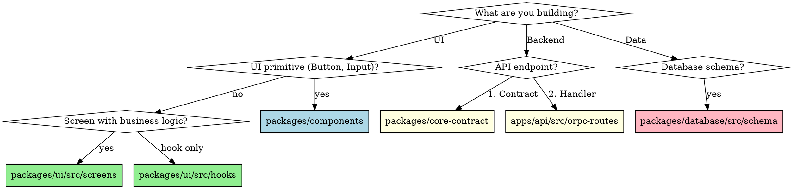

# Building Features in This Boilerplate

## Overview

This skill guides you through building features in the cross-platform monorepo. It ensures you use the right packages, follow layer conventions, and maintain consistency.

**Core principles:**

- Code goes in the LOWEST layer that makes sense
- Use oRPC for API contracts
- **ALL user-facing content MUST use i18n**

## i18n Rules (CRITICAL)

**Use i18n for:** UI text, error messages to users, emails, notifications, toasts, validation messages, API errors shown to users

**Keep in English:** Console logs, analytics events, Sentry errors, OpenTelemetry, database fields, code comments

```typescript
// ❌ BAD
<Button>Submit</Button>
throwError("FORBIDDEN", "No permission");

// ✅ GOOD
<Button>{t("actions.submit")}</Button>
throwError("FORBIDDEN", "errors.forbidden.noPermission");
```

**When adding user-facing text:** Add to English first (`packages/i18n/src/locales/en/`), then add to ALL other languages. See `i18n-manager` skill.

## When to Use

- Adding a new screen or page
- Creating an API endpoint
- Adding database tables
- Building a new feature end-to-end
- Modifying existing functionality

**For full feature builds with agent coordination, use `build-feature` instead.**

## Package Selection Flowchart



## Layer Reference

| Layer              | Packages                                                     | Purpose                          |
| ------------------ | ------------------------------------------------------------ | -------------------------------- |
| 1 - Foundation     | `core-contract`, `config`, `utils`                           | API contracts, RBAC, constants   |
| 2 - Infrastructure | `database`, `auth`                                           | Data layer, auth config & errors |
| 3 - Features       | `components`, `i18n`, `analytics`, `mailer`, `notifications` | Reusable features                |
| 4 - Business Logic | `ui`, `subscriptions`                                        | Screens, hooks, state, payments  |
| 5 - Applications   | `web`, `mobile`, `api`                                       | Platform-specific entry points   |

**Rule:** Lower layers CANNOT import from higher layers.

## Key Packages

| Package              | Purpose                                    | When to Use                                       |
| -------------------- | ------------------------------------------ | ------------------------------------------------- |
| `@app/core-contract` | oRPC API contracts                         | Defining API endpoint schemas                     |
| `@app/config`        | RBAC, constants                            | Role permissions, rate limits                     |
| `@app/auth`          | Better Auth config, clients, error classes | Email/password auth, verification, password reset |
| `@app/mailer`        | Email sending via Resend                   | Transactional emails                              |
| `@app/notifications` | Notifications via Novu + Expo Push         | Push, in-app notifications                        |
| `@app/subscriptions` | Payments via RevenueCat                    | Subscription management                           |
| `@app/analytics`     | Analytics via PostHog                      | Event tracking, feature flags                     |

### Package Responsibilities

| Need                                  | Package              |
| ------------------------------------- | -------------------- |
| API route contracts (oRPC)            | `@app/core-contract` |
| RBAC (roles, permissions)             | `@app/config`        |
| Constants (rate limits, query params) | `@app/config`        |
| Auth types and error classes          | `@app/auth`          |
| Screens, hooks, stores                | `@app/ui`            |

## Quick Reference: Where Does Code Go?

| What you're building       | Location                                    | Example                       |
| -------------------------- | ------------------------------------------- | ----------------------------- |
| Reusable button/input/card | `packages/components/src/`                  | `FormField`, `PrimaryButton`  |
| Error/Empty states         | `packages/components/src/ErrorStates/`      | `NetworkError`, `EmptyState`  |
| oRPC contract              | `packages/core-contract/src/contracts/`     | `settings.ts`                 |
| API route (private)        | `apps/api/src/orpc-routes/private/index.ts` | Add to privateRoutes object   |
| API route (public)         | `apps/api/src/orpc-routes/public/index.ts`  | Add to publicRoutes object    |
| Action (business logic)    | `apps/api/src/actions/`                     | `settings.ts`                 |
| Database table             | `packages/database/src/schema/tables/`      | `settings.ts`                 |
| RBAC config                | `packages/config/src/rbac/`                 | Add to permission matrix      |
| Application event          | `apps/api/src/lib/events.ts`                | Add to `AppEvents` type       |
| Notification handler       | `apps/api/src/lib/notification-handlers.ts` | Map event to notification     |
| Email template             | `packages/mailer/emails/`                   | `invite.tsx`                  |
| React query hook           | `packages/ui/src/hooks/queries/`            | `useSettings.ts`              |
| React mutation hook        | `packages/ui/src/hooks/mutations/`          | `useSettings.ts`              |
| Authenticated screen       | `packages/ui/src/screens/private/`          | `settings/SettingsScreen.tsx` |
| Auth screen (login/signup) | `packages/ui/src/screens/auth/`             | `Login.tsx`                   |
| Public screen (web only)   | `packages/ui/src/screens/public/`           | `Landing.tsx`                 |
| Translation strings        | `packages/i18n/src/locales/{en,es}/`        | `settings.json`               |
| Web route (private)        | `apps/web/src/app/(private)/`               | `settings/page.tsx`           |
| Web route (auth)           | `apps/web/src/app/(auth)/`                  | `login/page.tsx`              |
| Mobile route (private)     | `apps/mobile/src/app/(private)/`            | `settings.tsx`                |
| Mobile route (auth)        | `apps/mobile/src/app/(auth)/`               | `login.tsx`                   |

## API Route Structure

Routes are organized by **ACCESS LEVEL** in `apps/api/src/orpc-routes/`:

```
orpc-routes/
├── _implementer.ts    # Shared oRPC implementer (import `os` from here)
├── public/            # No auth required
│   └── index.ts       # health, waitlist
├── private/           # Auth required (most routes go here)
│   └── index.ts       # me, settings, todos, notifications, billing, etc.
├── admin/             # Auth + admin role required
│   └── index.ts       # admin-only operations
└── index.ts           # Combines public/private/admin routers
```

**Route organization within private/:**

- `user.*` - User-specific (me, settings, analytics)
- `workspace.*` - Multi-tenant (tenants, invites)
- `features.*` - Business features (todos, dashboard)
- `notifications.*` - Notification management
- `billing.*` - Subscription/billing

## API Middleware Reference

Use middleware in route handlers (order matters):

```typescript
// apps/api/src/orpc-routes/tasks.ts
import { TasksActions } from "../actions/tasks";
import {
  authMiddleware,
  tenantMiddleware,
  createRBACMiddleware,
  requireFeature,
} from "../middleware";
import { os } from "./_implementer"; // Always import os from _implementer

// Basic protected route
const get = os.tasks.get.use(authMiddleware).handler(async ({ input, context }) => {
  return TasksActions.get(input, context);
});

// Tenant-scoped route with RBAC
const create = os.tasks.create
  .use(authMiddleware)
  .use(tenantMiddleware)
  .use(createRBACMiddleware("task", "create"))
  .handler(async ({ input, context }) => {
    return TasksActions.create(input, context);
  });

// Premium feature
const analytics = os.tasks.analytics
  .use(authMiddleware)
  .use(tenantMiddleware)
  .use(requireFeature("analytics_dashboard"))
  .handler(async ({ context }) => {
    return TasksActions.analytics(context);
  });

export const tasksRoutes = { get, create, analytics };
```

## Building a Feature: Step-by-Step

### 1. Database (if needed)

```bash
# Create schema in tables/
packages/database/src/schema/tables/settings.ts

# Export from tables/index.ts
packages/database/src/schema/tables/index.ts

# Re-export from schema/index.ts
packages/database/src/schema/index.ts

# Generate migration
pnpm --filter database generate

# Apply migration
pnpm --filter database db:migrate
```

### 2. oRPC Contract

```typescript
// packages/core-contract/src/contracts/settings.ts
import { oc } from "@orpc/contract";
import { z } from "zod";

export const settingsContract = {
  get: oc
    .route({ method: "GET", path: "/settings" })
    .input(z.void())
    .output(
      z.object({
        emailNotifications: z.boolean(),
      })
    )
    .errors({
      UNAUTHORIZED: {},
    }),
};

// Export from packages/core-contract/src/router.ts
export const contract = {
  // ...existing
  settings: settingsContract,
};
```

### 3. Action Class

```typescript
// apps/api/src/actions/settings.ts
import { db } from "@app/database";
import { throwError } from "../lib/errors";
import type { AuthContext } from "../middleware/auth";

export class SettingsActions {
  static async get(context: AuthContext) {
    // Use throwError for errors (handled by lib/errors.ts)
    if (!context.user) {
      throwError("UNAUTHORIZED", "Not authenticated");
    }
    // Business logic here
    return { emailNotifications: true };
  }
}
```

### 4. Route Handler

Add routes to the appropriate access level file. Most routes go in `private/index.ts`.

```typescript
// apps/api/src/orpc-routes/private/index.ts
import { os } from "../_implementer";
import { authMiddleware, tenantMiddleware, createRBACMiddleware } from "../../middleware";
import { SettingsActions } from "../../actions/settings";

// Add route handlers
const settingsGet = os.private.user.settings.get
  .use(authMiddleware)
  .handler(async ({ context }) => {
    return SettingsActions.get(context);
  });

// Export in privateRoutes object
export const privateRoutes = {
  user: {
    settings: {
      get: settingsGet,
      // ... other settings routes
    },
  },
  // ... other domains
};
```

### 4b. Router Structure

The main router in `apps/api/src/orpc-routes/index.ts` combines access levels:

```typescript
import { publicRoutes } from "./public";
import { privateRoutes } from "./private";
import { adminRoutes } from "./admin";

export const router = os.router({
  public: publicRoutes, // No auth
  private: privateRoutes, // Auth required
  admin: adminRoutes, // Auth + admin
});
```

### 5. UI Hooks

```typescript
// packages/ui/src/hooks/queries/useSettings.ts
import { useQuery } from "@tanstack/react-query";
import { orpc } from "../../api";

export function useSettings() {
  return useQuery(orpc.settings.get.queryOptions());
}
```

### 6. Screen Component

```typescript
// packages/ui/src/screens/private/settings/SettingsScreen.tsx
import { View } from "react-native";
import { useSettings } from "../../../hooks";
import { NetworkError, GeneralError, EmptyState } from "@app/components";
import { useNetworkStatus } from "@app/components";

export function SettingsScreen() {
  const { data, isLoading, error, refetch } = useSettings();
  const { isOffline } = useNetworkStatus();

  if (isOffline) return <NetworkError onRetry={refetch} />;
  if (error) return <GeneralError title="Failed to load" message={error.message} onRetry={refetch} />;

  // Cross-platform screen implementation
}
```

### 7. Platform Routes

```typescript
// apps/web/src/app/(private)/settings/page.tsx
"use client";
import { SettingsScreen } from "@app/ui/screens";

export default function SettingsPage() {
  return <SettingsScreen />;
}

// apps/mobile/src/app/(private)/settings.tsx
import { SettingsScreen } from "@app/ui/screens";

export default function Settings() {
  return <SettingsScreen />;
}
```

## Critical Rules

**Screens:** ALL screens for web and mobile MUST go in `packages/ui/src/screens/`. Structure:

- `screens/auth/` - Login, signup, verify email
- `screens/private/` - All authenticated screens (dashboard, settings, todos, etc.)
- `screens/public/` - Web-only marketing pages (landing, pricing)

Never create screens in `apps/web/` or `apps/mobile/` - those only contain thin routing wrappers.

**Error Handling:** Use shared ErrorStates from `@app/components`:

- `NetworkError` - For offline/network errors
- `GeneralError` - Customizable error with retry
- `EmptyState` - For empty lists/content
- `EmptySearchResults`, `EmptyList`, `EmptyNotifications` - Presets

**Responsive Design:** ALL screens MUST be responsive and work on ALL device sizes. Use `useWindowDimensions` with breakpoints: small (<380px), medium (380-768px), large (≥768px). See frontend-designer skill for patterns.

**Platform-Specific Auth:** Mobile MUST pass native auth client functions (like `signOut`) to shared screens. The web and mobile clients are separate instances with separate state.

**Text/Translations:** ALL user-facing text MUST go in `packages/i18n/src/locales/`. Never hardcode strings. Use `useTranslation()` hook. See `i18n-manager` skill for adding translations or new languages. Supported languages are defined in `packages/i18n/src/languages.json`.

## Common Mistakes

| Mistake                         | Correct Approach                                                |
| ------------------------------- | --------------------------------------------------------------- |
| Put screen in `apps/web`        | Put in `packages/ui/src/screens` for sharing                    |
| Put screen in `apps/mobile`     | Put in `packages/ui/src/screens` for sharing                    |
| Non-responsive screens          | Use `useWindowDimensions` with breakpoints for ALL screen sizes |
| Fixed padding/font sizes        | Use dynamic values based on screen width                        |
| Skip small screen testing       | Test on iPhone SE (375px), not just iPhone 15                   |
| Use `typeof window`             | Use `Platform.OS === "web"` for platform checks                 |
| Omit signOut prop (mobile)      | Mobile MUST pass `signOut` from `@app/auth/client/native`       |
| Hardcode text in screens        | Use `t("key")` from `useTranslation()` hook                     |
| Hardcode error messages         | Use i18n keys: `throwError("FORBIDDEN", "errors.noPermission")` |
| Hardcode email content          | Use i18n for email subjects and body text                       |
| Hardcode notification text      | Use i18n for push notification content                          |
| Forget translations             | Add to ALL languages in `packages/i18n/src/locales/`            |
| Only add English translation    | Must add to ALL supported languages                             |
| Use old apiClient               | Use oRPC client from `@app/ui`                                  |
| Skip core-contract              | Always define contracts first for type safety                   |
| Write migration manually        | Use `pnpm --filter database generate`                           |
| Business logic in routes        | Put business logic in `apps/api/src/actions/`                   |
| Use sentryMiddleware            | Removed - errors captured by handler.ts onError                 |
| Throw raw Error in actions      | Use `throwError()` from `lib/errors.ts`                         |
| Import ORPCError directly       | Use `throwError()` wrapper for consistent errors                |
| Skip tenant middleware          | Use `tenantMiddleware` for tenant-scoped routes                 |
| Hardcode role checks            | Use `createRBACMiddleware()` from config                        |
| Check features manually         | Use `requireFeature()` for subscription gating                  |
| Import `os` from @orpc/server   | Import `os` from `./_implementer`                               |
| Add routes to index.ts directly | Create feature file, then import into index.ts                  |

## Red Flags - Stop and Reconsider

- **Creating a screen in `apps/web/` or `apps/mobile/`** - screens go in `packages/ui/src/screens/`
- **Hardcoding user-facing text** - use `packages/i18n/src/locales/` and `useTranslation()` hook
- **Using fixed padding/font sizes** - use `useWindowDimensions` for responsive design
- **Not testing on small screens** - test on iPhone SE (375px), not just large phones
- **Using `typeof window !== "undefined"`** - use `Platform.OS === "web"` instead
- **Mobile not passing signOut prop** - mobile MUST pass `signOut` from `@app/auth/client/native`
- Creating a new package (use existing layers)
- Importing from higher layer to lower layer
- Putting business logic in `packages/components`
- Putting platform-specific code in `packages/ui` without Platform.OS checks
- Using old apiClient instead of oRPC
- Not using core-contract for API types
- Using `sentryMiddleware` (removed - errors captured at handler level)
- Importing `ORPCError` directly (use `throwError()` from `lib/errors.ts`)
- Importing `os` from `@orpc/server` (use `os` from `./_implementer`)
- Adding all routes directly to index.ts (create feature-specific files)

## Verification Checklist

Before marking a feature complete:

### Type Safety (Run First!)

- [ ] `pnpm typecheck` passes with NO errors
- [ ] No `any` types in new code
- [ ] No `@ts-nocheck` directives
- [ ] Catch blocks use `catch (err: unknown)` not `catch (err: any)`
- [ ] Database queries have typed returns
- [ ] Form fields use minimal typed interfaces

### Backend

- [ ] Contract in `packages/core-contract/src/contracts/` and exported from `router.ts`
- [ ] Database schema in `packages/database` (if needed)
- [ ] RBAC permissions in `packages/config/src/rbac/` (if new resource)
- [ ] Action in `apps/api/src/actions` using `throwError()` for errors
- [ ] Feature route file created: `apps/api/src/orpc-routes/<feature>.ts`
  - Uses `os` from `./_implementer`
  - Exports `<feature>Routes` object
- [ ] Routes registered in `apps/api/src/orpc-routes/index.ts`
- [ ] Routes use correct middleware stack:
  - `authMiddleware` for all protected routes
  - `tenantMiddleware` for tenant-scoped resources
  - `createRBACMiddleware(resource, action)` for role-based access
  - `requireFeature(feature)` for premium features

### Events & Notifications

- [ ] Events emitted in actions (if notifications needed):
  - Event type added to `apps/api/src/lib/events.ts`
  - `emit()` called in action after successful operation
- [ ] Notification handlers (if events need to notify users):
  - Handler added to `apps/api/src/lib/notification-handlers.ts`
  - Uses `notificationStream.publish()` for real-time delivery
- [ ] Emails sent via `@app/mailer` (if transactional email needed)

### Frontend

- [ ] Hook in `packages/ui/src/hooks`
- [ ] Screen in `packages/ui/src/screens`
- [ ] **Screen is responsive (uses `useWindowDimensions` with breakpoints)**
- [ ] **Screen tested on ALL device sizes:**
  - [ ] Small phone (<380px) - iPhone SE
  - [ ] Large phone (380-768px) - iPhone 15
  - [ ] Tablet/Desktop (≥768px) - iPad/browser
- [ ] Routes in both `apps/web` and `apps/mobile`
- [ ] **Mobile route passes platform-specific auth functions (signOut, etc.)**

### Internationalization

- [ ] Translations in `packages/i18n` (ALL supported languages)
- [ ] No hardcoded user-facing strings
- [ ] Error messages use i18n keys

### Final Check

- [ ] TypeScript compiles (`pnpm typecheck`)
- [ ] Linting passes (`pnpm lint`)
- [ ] All tests pass (`pnpm test`)

## Type Safety Patterns

### Database Queries

```typescript
// ❌ BAD - implicit any from relations
const invite = await db.query.tenantInvites.findFirst({
  with: { tenant: true, inviter: true },
});
invite.inviter.name; // May error

// ✅ GOOD - null check after query
const invite = await db.query.tenantInvites.findFirst({
  where: eq(tenantInvites.token, token),
  with: { tenant: true, inviter: true },
});
if (!invite) {
  throwError("NOT_FOUND", "errors:notFound.invite");
}
// Now TypeScript knows invite exists
return { inviterName: invite.inviter.name };
```

### Catch Blocks

```typescript
// ❌ BAD - any in catch
catch (err: any) {
  if (err.code === "UNAUTHORIZED") { ... }
}

// ✅ GOOD - unknown with type assertion
catch (err: unknown) {
  const error = err as { code?: string };
  if (error?.code === "UNAUTHORIZED") { ... }
}
```

### Form Field Types

```typescript
// ❌ BAD - overly generic FieldApi with many any params
interface Props {
  field: FieldApi<any, any, any, any, any, any, any, any>;
}

// ✅ GOOD - minimal interface with what you actually use
interface FormField {
  state: { value: string; meta: { errors?: string[] } };
  handleChange: (value: string) => void;
  handleBlur: () => void;
}

interface Props {
  field: FormField;
}
```

### Component Refs

```typescript
// ❌ BAD - @ts-nocheck at file level
// @ts-nocheck
export function Component() { ... }

// ✅ GOOD - targeted @ts-expect-error with explanation
// @ts-expect-error - library types incomplete for ref forwarding to View
ref={innerRef as React.Ref<View>}
```

## Senior Developer Tips

### 1. Always Read Before Writing

Before modifying ANY file:

- Read the existing code to understand patterns
- Check related files for consistency
- Look at imports/exports to understand dependencies

### 2. Run Typecheck Often

```bash
# After every significant change
pnpm --filter <package> typecheck

# Before committing
pnpm typecheck
```

### 3. Know the Common Pitfalls

| Pitfall             | Why It Happens         | Prevention               |
| ------------------- | ---------------------- | ------------------------ |
| `any` in catch      | Convenience            | Always use `unknown`     |
| Missing null checks | Query might not return | Check before accessing   |
| Hardcoded strings   | Faster initially       | Use i18n from start      |
| Non-responsive UI   | Only test one device   | Test all breakpoints     |
| Mobile auth broken  | Forgot platform client | Always pass signOut prop |

### 4. Use the Right Middleware Stack

```typescript
// Route protection levels (pick one):

// Level 1: Auth only (any authenticated user)
.use(authMiddleware)

// Level 2: Auth + Tenant (must be in tenant)
.use(authMiddleware)
.use(tenantMiddleware)

// Level 3: Auth + Tenant + RBAC (specific permission)
.use(authMiddleware)
.use(tenantMiddleware)
.use(createRBACMiddleware("resource", "action"))

// Level 4: Auth + Tenant + Admin only
.use(authMiddleware)
.use(tenantMiddleware)
.use(requireAdmin)
```

### 5. Error Message Pattern

```typescript
// API errors use i18n keys
throwError("FORBIDDEN", "errors:forbidden.noPermission");

// Client translates the key
const { t } = useTranslation("errors");
toast.error(t(error.message)); // "You don't have permission"
```

### 6. When in Doubt, Check Existing Code

- Look at `apps/api/src/actions/me.ts` for action patterns
- Look at `apps/api/src/orpc-routes/invites.ts` for route patterns
- Look at `packages/ui/src/screens/settings/` for screen patterns
- Look at `packages/ui/src/hooks/mutations/useSettings.ts` for hook patterns
