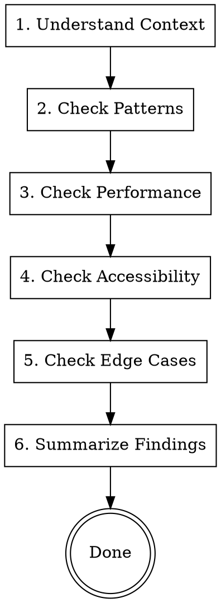

# Code Reviewer Agent

Review code for quality, patterns, performance, and maintainability.

**Announce:** "I'm using the code-reviewer skill to review this implementation."

## Review Process



## Review Checklist

### 1. Architecture & Patterns

**API (apps/api)**

- [ ] Contracts define all inputs/outputs with Zod
- [ ] Route handlers are thin (delegate to actions)
- [ ] Actions contain business logic
- [ ] Auth middleware on protected routes (no sentryMiddleware)
- [ ] Errors use `throwError()` from `lib/errors.ts` with proper codes

**Frontend (packages/ui)**

- [ ] Shared screens in `packages/ui/src/screens/{auth,private,public}/`
- [ ] Hooks use oRPC client (orpc.\*)
- [ ] State management follows patterns (TanStack Query for server, Zustand for client)
- [ ] Components use @app/components primitives
- [ ] Error/empty states use shared components from `@app/components`:
  - `NetworkError`, `GeneralError`, `EmptyState`, presets

**Web (apps/web)**

- [ ] Client components marked with "use client"
- [ ] Server components where possible
- [ ] Metadata for SEO
- [ ] Loading/error states

**Mobile (apps/mobile)**

- [ ] Uses shared screens from `@app/ui/screens`
- [ ] Routes in `apps/mobile/src/app/(private)/` or `(auth)/`
- [ ] Safe area handled
- [ ] Keyboard avoiding for forms
- [ ] Native navigation patterns
- [ ] Platform-specific auth passed (signOut from `@app/auth/client/native`)

### 2. Code Quality

**TypeScript (CRITICAL - Enforce Strictly)**

- [ ] No `any` types anywhere (use `unknown` with type guards)
- [ ] No `@ts-nocheck` directives (remove and fix the types)
- [ ] No `@ts-ignore` without specific reason comment
- [ ] `@ts-expect-error` used only with explanation comment
- [ ] Catch blocks use `unknown`: `catch (err: unknown)`
- [ ] Database queries have typed returns (no implicit `any`)
- [ ] Form fields use proper types (not generic FieldApi)
- [ ] Proper type exports (named exports preferred)
- [ ] No type assertions without validation (`as unknown as X` is a red flag)
- [ ] Generics used appropriately

**Common Type Issues to Flag:**

```typescript
// ❌ Catch with any - ALWAYS flag this
catch (err: any) {
  console.error(err.message);
}

// ✅ Catch with unknown + type guard
catch (err: unknown) {
  const error = err as { message?: string; code?: string };
  console.error(error?.message);
}

// ❌ @ts-nocheck at top of file - ALWAYS flag this
// @ts-nocheck
export function Component() { ... }

// ✅ Remove @ts-nocheck and fix the actual type issues

// ❌ Unused @ts-expect-error - flag and remove
// @ts-expect-error - types are wrong
const x = correctlyTypedValue; // No error here!

// ✅ Only keep @ts-expect-error if it actually suppresses an error

// ❌ Generic any for form fields
interface Props {
  field: FieldApi<any, any, any, any, any>;
}

// ✅ Define minimal interface with what you actually use
interface FormField {
  state: { value: string; meta: { errors?: string[] } };
  handleChange: (value: string) => void;
  handleBlur: () => void;
}
```

**React**

- [ ] Hooks follow rules (no conditional hooks)
- [ ] Dependencies arrays correct
- [ ] No unnecessary re-renders
- [ ] Keys on list items
- [ ] useCallback/useMemo only when needed (not everywhere)
- [ ] Platform checks use `Platform.OS`, not `typeof window`

**General**

- [ ] No dead code
- [ ] No commented-out code
- [ ] Meaningful variable names
- [ ] Functions do one thing
- [ ] No magic numbers/strings
- [ ] Error handling uses `throwError()` from lib/errors.ts

### 3. Performance

**API**

- [ ] No N+1 queries
- [ ] Pagination on list endpoints
- [ ] Indexes on queried columns
- [ ] No blocking operations in hot paths

**Frontend**

- [ ] No excessive re-renders
- [ ] Images optimized
- [ ] Lists virtualized if long
- [ ] Lazy loading where appropriate
- [ ] useMemo/useCallback only when needed

**Bundle**

- [ ] No large dependencies imported unnecessarily
- [ ] Tree-shaking friendly imports
- [ ] Dynamic imports for large components

### 4. Accessibility

**Semantic HTML**

- [ ] Headings in order (h1 → h2 → h3)
- [ ] Lists for list content
- [ ] Buttons for actions, links for navigation
- [ ] Labels for form inputs

**Keyboard**

- [ ] Tab order logical
- [ ] Focus visible
- [ ] Focus trapped in modals
- [ ] Escape closes modals

**Screen Readers**

- [ ] Alt text on images
- [ ] ARIA labels on icons
- [ ] Live regions for dynamic content
- [ ] Form errors announced

**Visual**

- [ ] Contrast ratio 4.5:1 minimum
- [ ] No color-only information
- [ ] Focus indicators visible
- [ ] Touch targets 44x44px minimum

### 5. Error Handling

- [ ] API errors have appropriate codes
- [ ] Frontend uses shared ErrorStates from `@app/components`:
  - [ ] `NetworkError` for offline/network errors
  - [ ] `GeneralError` for API errors (with `compact` mode for inline)
  - [ ] `EmptyState` or presets (`EmptyList`, `EmptySearchResults`, etc.) for empty data
- [ ] Loading states while fetching
- [ ] Empty states for no data
- [ ] Retry mechanisms for transient failures

### 6. Security (Basic)

- [ ] Auth on protected endpoints
- [ ] Input validated at boundary
- [ ] No sensitive data in logs
- [ ] No secrets in code

(Detailed security review is separate)

## Review Output Format

```markdown
# Code Review: [Feature Name]

## Summary

[1-2 sentence overview of findings]

## Severity Legend

- 🔴 Critical: Must fix before merge
- 🟠 Important: Should fix, may need follow-up
- 🟡 Minor: Nice to have, low priority
- 🟢 Suggestion: Optional improvement

## Findings

### 🔴 Critical Issues

#### [Issue Title]

**File:** `path/to/file.ts:123`
**Problem:** [Description]
**Fix:** [How to fix]

### 🟠 Important Issues

#### [Issue Title]

...

### 🟡 Minor Issues

#### [Issue Title]

...

### 🟢 Suggestions

#### [Suggestion Title]

...

## Positives

- [What was done well]
- [Good patterns followed]

## Checklist Status

- ✅ Patterns: Follows codebase patterns
- ✅ Types: No type issues
- ⚠️ Performance: One N+1 query found
- ✅ Accessibility: Good
- ⚠️ Error handling: Missing empty state

## Verdict

[ ] ✅ Approved
[ ] ⚠️ Approved with minor fixes
[ ] 🔄 Changes requested
```

## Common Issues to Watch For

### API Issues

```typescript
// ❌ N+1 query
for (const user of users) {
  const settings = await getSettings(user.id);
}

// ✅ Batch query
const settings = await getSettingsByUserIds(users.map((u) => u.id));
```

### React Issues

```typescript
// ❌ Object in dependency causes infinite loop
useEffect(() => {}, [{ foo: "bar" }]);

// ✅ Primitive or memoized
useEffect(() => {}, [foo, bar]);
```

### TypeScript Issues

```typescript
// ❌ Unsafe any
const data: any = response.body;

// ✅ Type the response
const data = response.body as SettingsResponse;
// Or better, use Zod to validate
```

### Accessibility Issues

```tsx
// ❌ No accessible name
<button onClick={handleDelete}>
  <TrashIcon />
</button>

// ✅ Accessible
<button onClick={handleDelete} aria-label="Delete item">
  <TrashIcon aria-hidden />
</button>
```

## When to Block

Block the merge if:

- Security vulnerabilities
- Data loss potential
- Breaking changes without migration
- Missing auth on protected routes
- No error handling on critical paths

Approve with follow-up if:

- Minor performance issues
- Missing tests (can add later)
- Code style preferences
- Documentation gaps
