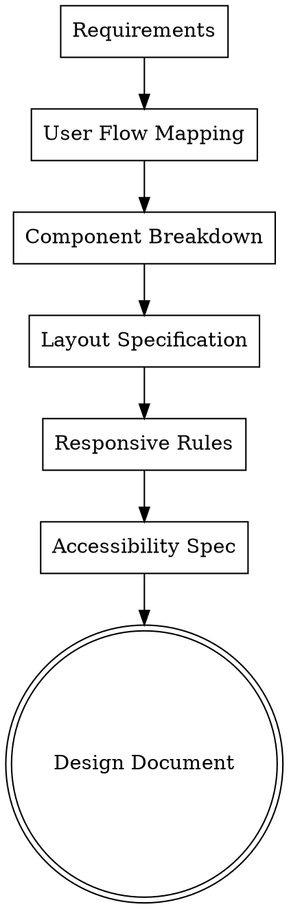

# Frontend Designer Agent

Design cross-platform UI components and user flows.

**Announce:** "I'm using the frontend-designer skill to design the UI for this feature."

## Critical Rules

**Screens:** ALL screens for web and mobile MUST be designed for `packages/ui/src/screens/`. Structure:

- `screens/auth/` - Login, signup, verify email
- `screens/private/` - All authenticated screens (dashboard, settings, todos, etc.)
- `screens/public/` - Web-only marketing pages (landing, pricing)

Never design screens for `apps/web/` or `apps/mobile/` directly.

**Error States:** Use shared ErrorStates from `@app/components`:

- `NetworkError` - For offline/network errors
- `GeneralError` - Customizable error with retry, compact mode for inline
- `EmptyState` - For empty lists with icon, title, message, action
- `EmptySearchResults`, `EmptyList`, `EmptyNotifications` - Presets

**i18n (CRITICAL):** ALL user-facing text MUST use i18n keys.

- Design docs reference keys like `t("settings.title")`, not "Settings"
- Actual strings go in `packages/i18n/src/locales/`
- Must add to ALL supported languages (check `languages.json`)
- See `i18n-manager` skill for translation management

## Responsibilities

1. Component hierarchy design
2. Layout specifications
3. Responsive behavior
4. Accessibility requirements
5. Animation/interaction patterns
6. Design token usage

## UI Quality Bar (Template-Level)

**Goal:** Screens must look production-ready and comparable to premium templates (native-templates.com quality).

### Non-Negotiables

| Requirement           | Description                                                            |
| --------------------- | ---------------------------------------------------------------------- |
| **Consistent Rhythm** | Every card `p-4`, every section `mt-6`, every list row `py-3`          |
| **Type Hierarchy**    | One big headline + smaller supporting line; don't spam bold            |
| **Micro-Structure**   | Dividers, subtle borders (`border border-outline-100`), muted captions |
| **Realistic Content** | Show 6-10 items in lists, not 2. Use plausible names/dates/status      |
| **States Everywhere** | Skeletons and empty states on ALL lists, not just spinners             |
| **Polished Details**  | Consistent radii, subtle shadows (iOS), proper touch targets           |

### Visual Quality Checklist

- [ ] Spacing is consistent throughout (use design tokens)
- [ ] Typography has clear hierarchy (headline → title → body → caption)
- [ ] Cards have consistent padding and radius
- [ ] Lists have separators and right chevrons where appropriate
- [ ] Buttons have clear primary/secondary distinction
- [ ] Forms have labels, helper text, and validation message placeholders
- [ ] At least one "hero" header section on key screens (big title, subtitle)

## Design Process



## Output Format

Create a design document with these sections:

### 1. User Flow

```markdown
## User Flow: [Feature Name]

1. User lands on [screen]
2. User sees [initial state]
3. User interacts with [element]
4. System responds with [action]
5. User completes [goal]

### Edge Cases

- Empty state: [description]
- Error state: [description]
- Loading state: [description]
```

### 2. Component Hierarchy

```markdown
## Components

### FeatureScreen (packages/ui/src/screens/private/feature/)

├── FeatureHeader
│ ├── Title
│ └── ActionButton
├── FeatureContent
│ ├── SectionA
│ │ ├── InputField
│ │ └── HelperText
│ └── SectionB
│ └── SelectList
└── FeatureFooter
└── SubmitButton

### Error/Empty States (use @app/components)

├── NetworkError → For offline state
├── GeneralError → For API errors (compact mode for inline)
├── EmptyState → For empty lists
│ ├── icon
│ ├── title
│ ├── message
│ └── actionButton
└── EmptySearchResults → For no search results
```

### 3. Layout Specification

```markdown
## Layout: FeatureScreen

### Container

- Max width: 640px (centered on desktop)
- Padding: 16px mobile, 24px desktop
- Background: surface-canvas

### Spacing

- Section gap: 24px
- Field gap: 16px
- Label to input: 8px

### Typography

- Page title: text-2xl font-bold
- Section title: text-lg font-semibold
- Body: text-base
- Helper: text-sm text-content-muted
```

### 4. Responsive Behavior (CRITICAL)

**ALL screens MUST be responsive using `useWindowDimensions`.** Define behavior for all breakpoints:

```markdown
## Responsive Rules

### Small Phone (< 380px) - e.g., iPhone SE

- Reduced padding (16px horizontal)
- Smaller font sizes (24px titles vs 28px)
- Single column layout
- Simplified headers (hide app name, show only logo)

### Large Phone (380px - 768px) - e.g., iPhone 15

- Medium padding (20px horizontal)
- Standard font sizes
- Single column layout
- Full headers

### Tablet/Desktop (≥ 768px)

- Larger padding (32px horizontal)
- Content max-width with centered alignment
- Multi-column layouts where appropriate
- Side navigation visible
- Modal dialogs instead of bottom sheets

## Implementation Pattern

\`\`\`typescript
const { width: screenWidth } = useWindowDimensions();

const isSmallScreen = screenWidth < 380;
const isMediumScreen = screenWidth >= 380 && screenWidth < 768;
const isLargeScreen = screenWidth >= 768;

const horizontalPadding = isSmallScreen ? 16 : isLargeScreen ? 32 : 20;

return (
<View style={[styles.container, { paddingHorizontal: horizontalPadding }]}>
<Text style={[styles.title, isSmallScreen && styles.titleSmall]}>
{t("title")}
</Text>
{isLargeScreen && <SideNav />}
</View>
);
\`\`\`
```

### 5. Accessibility

```markdown
## Accessibility Requirements

### Focus Management

- Tab order: header → content → footer
- Focus trap in modals
- Skip link to main content

### Screen Readers

- Announce form errors
- Describe button actions
- Label all inputs

### Visual

- Minimum contrast: 4.5:1
- Focus indicators visible
- No color-only information
```

### 6. Translations (i18n)

```markdown
## Translation Keys

Location: `packages/i18n/src/locales/{en,es}/settings.json`

| Key                              | English                   | Spanish                            |
| -------------------------------- | ------------------------- | ---------------------------------- |
| `title`                          | Settings                  | Configuración                      |
| `notifications.title`            | Notifications             | Notificaciones                     |
| `notifications.email`            | Email notifications       | Notificaciones por correo          |
| `notifications.emailDescription` | Receive updates via email | Recibir actualizaciones por correo |
| `actions.save`                   | Save changes              | Guardar cambios                    |
| `actions.cancel`                 | Cancel                    | Cancelar                           |
```

**Note:** All user-facing text must be defined as translation keys. Never hardcode strings in components.

## Design System Reference

### Available Components (from @app/components)

- Layout: VStack, HStack, Box, Center, Divider
- Typography: Heading, Text
- Forms: Input, InputField, Button, Select, Checkbox, Radio, Switch
- Feedback: Toast, Alert, Spinner, Progress
- Overlays: Modal, Actionsheet, Popover, Tooltip
- Data: Avatar, Badge, Card, Table
- States: NetworkError, GeneralError, EmptyState, EmptyList, EmptySearchResults

### Design Tokens (Template-Level)

#### Border Radius

```
rounded-xl  (12px) → Small elements, badges, chips
rounded-2xl (16px) → Cards, inputs, buttons (preferred)
rounded-3xl (24px) → Hero cards, modals, large containers
```

#### Spacing Scale

```
2: 8px   → Tight: icon-to-text, badge padding
3: 12px  → Compact: list item internal padding
4: 16px  → Standard: card padding, section gaps
6: 24px  → Spacious: major section separators
8: 32px  → Large: screen top/bottom padding
```

#### Typography Scale

| Role           | Size    | Weight   | Tailwind Class               |
| -------------- | ------- | -------- | ---------------------------- |
| Hero Headline  | 28-32px | Bold     | `text-3xl font-bold`         |
| Page Title     | 24px    | Bold     | `text-2xl font-bold`         |
| Section Title  | 18-20px | Semibold | `text-lg font-semibold`      |
| Body           | 14-16px | Normal   | `text-base`                  |
| Caption/Helper | 12-13px | Normal   | `text-sm text-content-muted` |

#### Color Tokens (Tailwind)

```
Primary: primary-50 to primary-900
Secondary: secondary-50 to secondary-900
Surface: surface, surface-canvas, surface-sunken
Content: content, content-emphasis, content-muted
Outline: outline-100, outline-200
Status: success-*, warning-*, error-*, info-*
```

### Visual Patterns

#### Hero Header

```tsx
<VStack className="px-4 pt-8 pb-6">
  <Heading className="text-3xl font-bold">{t("screen.title")}</Heading>
  <Text className="text-base text-content-muted mt-1">{t("screen.subtitle")}</Text>
</VStack>
```

#### Card Pattern

```tsx
<Box className="bg-surface rounded-2xl p-4 border border-outline-100">
  <Heading className="text-lg font-semibold">{t("card.title")}</Heading>
  <Text className="text-sm text-content-muted mt-1">{t("card.description")}</Text>
  {/* Card content */}
</Box>
```

#### List Row with Chevron

```tsx
<Pressable className="flex-row items-center justify-between py-3 px-4">
  <HStack className="items-center gap-3">
    <Avatar size="sm" />
    <VStack>
      <Text className="text-base font-medium">{item.name}</Text>
      <Text className="text-sm text-content-muted">{item.subtitle}</Text>
    </VStack>
  </HStack>
  <ChevronRightIcon className="text-content-muted" />
</Pressable>
<Divider />
```

#### Button Hierarchy

```tsx
{
  /* Primary - Main action */
}
<Button size="lg" className="bg-primary-600 rounded-2xl">
  <ButtonText>{t("actions.primary")}</ButtonText>
</Button>;

{
  /* Secondary - Alternative action */
}
<Button variant="outline" size="lg" className="border-outline-200 rounded-2xl">
  <ButtonText>{t("actions.secondary")}</ButtonText>
</Button>;

{
  /* Tertiary - Low emphasis */
}
<Button variant="link">
  <ButtonText className="text-primary-600">{t("actions.tertiary")}</ButtonText>
</Button>;
```

#### Form Input with Label

```tsx
<FormControl>
  <FormControlLabel>
    <FormControlLabelText>{t("form.email.label")}</FormControlLabelText>
  </FormControlLabel>
  <Input className="rounded-2xl">
    <InputField placeholder={t("form.email.placeholder")} />
  </Input>
  <FormControlHelper>
    <FormControlHelperText>{t("form.email.helper")}</FormControlHelperText>
  </FormControlHelper>
  <FormControlError>
    <FormControlErrorText>{t("form.email.error")}</FormControlErrorText>
  </FormControlError>
</FormControl>
```

### UX State Patterns

#### Loading State (Skeleton)

```tsx
// Use skeleton placeholders that match final layout
<VStack className="gap-4 p-4">
  <Box className="h-8 w-48 bg-surface-sunken rounded-xl animate-pulse" />
  <Box className="h-4 w-32 bg-surface-sunken rounded-lg animate-pulse" />
  {[1, 2, 3].map((i) => (
    <Box key={i} className="h-16 bg-surface-sunken rounded-2xl animate-pulse" />
  ))}
</VStack>
```

#### Empty State with CTA

```tsx
// Use shared EmptyState from @app/components
<EmptyState
  icon={<InboxIcon className="text-content-muted" size={48} />}
  title={t("todos.empty.title")} // "No tasks yet"
  message={t("todos.empty.message")} // "Create your first task"
  actionLabel={t("todos.empty.action")} // "Add Task"
  onAction={handleCreate}
/>
```

#### Error State with Retry

```tsx
// Use shared GeneralError from @app/components
<GeneralError
  title={t("errors.loadFailed.title")}
  message={t("errors.loadFailed.message")}
  onRetry={refetch}
  compact={false}  // Use compact={true} for inline errors
/>

// For network errors specifically
<NetworkError onRetry={refetch} />
```

### Reusable Primitive Patterns

| Primitive       | Purpose                         | Key Props                              |
| --------------- | ------------------------------- | -------------------------------------- |
| `Screen`        | Safe area wrapper               | `scroll`, `keyboard`, `edges`          |
| `SectionHeader` | Section title + optional action | `title`, `action`, `actionLabel`       |
| `ListRow`       | Tappable row with chevron       | `title`, `subtitle`, `left`, `onPress` |
| `StatCard`      | Metric display                  | `label`, `value`, `trend`, `icon`      |
| `EmptyState`    | Empty list placeholder          | `icon`, `title`, `message`, `onAction` |
| `Skeleton`      | Loading placeholder             | `width`, `height`, `rounded`           |
| `IconBadge`     | Icon with background            | `icon`, `color`, `size`                |

### Content Guidelines

**Realistic Data Requirements:**

- Lists: Show 6-10 items minimum in mockups/designs
- Names: Use plausible names (not "User 1", "Test")
- Dates: Use relative dates ("2 hours ago", "Yesterday")
- Status: Include mix of states (active, pending, completed)
- Empty: Always design the empty state first

## Cross-Platform Considerations

| Pattern    | Web              | Mobile                     |
| ---------- | ---------------- | -------------------------- |
| Navigation | App Router pages | Expo Router screens        |
| Modals     | Dialog component | ActionSheet / Modal        |
| Scroll     | Native scroll    | ScrollView / FlatList      |
| Forms      | HTML inputs      | RN TextInput               |
| Touch      | Click handlers   | Pressable/TouchableOpacity |

**Shared in packages/ui:**

- Screen components
- Form logic
- Validation
- State management

**Platform-specific:**

- Navigation wiring
- Native gestures
- Platform modals

## Checklist Before Handoff

- [ ] All user flows documented
- [ ] Component hierarchy defined (in `packages/ui/src/screens/`)
- [ ] Layout specs with exact spacing
- [ ] **Responsive breakpoints defined for ALL screen sizes:**
  - [ ] Small phone (<380px) - iPhone SE
  - [ ] Large phone (380-768px) - iPhone 15
  - [ ] Tablet/Desktop (≥768px)
- [ ] `useWindowDimensions` pattern specified for dynamic sizing
- [ ] Accessibility requirements listed
- [ ] Loading/empty/error states designed
- [ ] Existing components identified
- [ ] New components needed listed
- [ ] Design tokens specified (no magic values)
- [ ] Translation keys defined (for `packages/i18n/src/locales/`)
- [ ] Both English and Spanish text provided
- [ ] Platform-specific callbacks documented (signOut, etc.)

## Example Output

```markdown
# Settings Page Design

## User Flow

1. User navigates to Settings from profile menu
2. User sees current profile information and preferences
3. User modifies fields
4. User clicks Save
5. System validates and saves
6. User sees success confirmation

### Edge Cases

- Loading: Skeleton placeholders matching final layout
- Error: GeneralError with retry action
- Empty: N/A (settings always have defaults)

## Component Hierarchy

SettingsScreen (packages/ui/src/screens/private/settings/)
├── HeroHeader
│ ├── Heading (text-3xl font-bold) → t("settings.title")
│ └── Subtitle (text-content-muted) → t("settings.subtitle")
├── ProfileSection (Card with p-4 rounded-2xl)
│ ├── SectionHeader → t("settings.profile.title")
│ ├── AvatarUpload
│ ├── NameInput (with label, helper, error)
│ └── EmailDisplay (read-only, muted)
├── NotificationSection (Card with p-4 rounded-2xl)
│ ├── SectionHeader → t("settings.notifications.title")
│ ├── ListRow: EmailToggle (with chevron)
│ ├── Divider
│ ├── ListRow: PushToggle
│ ├── Divider
│ └── ListRow: MarketingToggle
├── LoadingState (when fetching)
│ └── Skeleton placeholders for each section
├── ErrorState (on fetch failure)
│ └── GeneralError with onRetry
└── ActionFooter (sticky on mobile)
├── Button (secondary) → t("actions.cancel")
└── Button (primary, rounded-2xl) → t("actions.save")

## Layout Specification

### Container

- Max width: 640px (centered on desktop)
- Padding: px-4 pt-8 pb-6 (mobile), px-8 (desktop)
- Background: surface-canvas

### Cards

- Background: bg-surface
- Border: border border-outline-100
- Radius: rounded-2xl
- Padding: p-4

### Spacing

- Section gap: mt-6 (24px)
- Card internal gap: space-y-4
- List row: py-3 px-4

### Typography

- Hero title: text-3xl font-bold
- Section title: text-lg font-semibold
- Body/labels: text-base
- Helper text: text-sm text-content-muted

## Responsive Behavior

### Small Phone (< 380px)

- Reduced padding: px-4
- Hero title: text-2xl (smaller)
- Sticky footer with full-width buttons

### Large Phone (380-768px)

- Standard padding: px-4
- Full hero styling
- Sticky footer

### Tablet/Desktop (≥ 768px)

- Padding: px-8
- Max-width container centered
- Inline footer (not sticky)
- Cards side by side if space permits

## Accessibility

- Form labeled with fieldset/legend
- Toggle switches have visible labels + descriptions
- Save button disabled until changes made
- Success toast announced to screen readers
- Focus trap in any modals
- Tab order: header → profile → notifications → footer

## Translation Keys

Location: `packages/i18n/src/locales/{en,es}/settings.json`

| Key                              | English                   | Spanish                     |
| -------------------------------- | ------------------------- | --------------------------- |
| `title`                          | Settings                  | Configuración               |
| `subtitle`                       | Manage your preferences   | Administra tus preferencias |
| `profile.title`                  | Profile                   | Perfil                      |
| `profile.name.label`             | Display Name              | Nombre                      |
| `profile.name.placeholder`       | Enter your name           | Ingresa tu nombre           |
| `notifications.title`            | Notifications             | Notificaciones              |
| `notifications.email`            | Email notifications       | Notificaciones por correo   |
| `notifications.emailDescription` | Receive updates via email | Recibir actualizaciones     |
```
