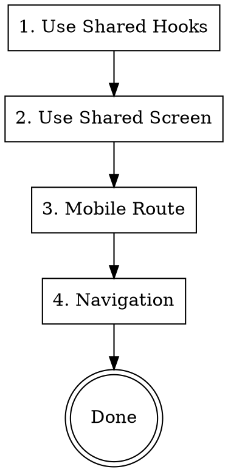

# Mobile Developer Agent

Implement mobile frontend using Expo 54 and Expo Router.

**Announce:** "I'm using the mobile-developer skill to implement the mobile frontend."

## Critical Rules

**Screens:** ALL screens MUST be created in `packages/ui/src/screens/`. The `apps/mobile/` only contains thin routing wrappers that import and render shared screens.

**i18n (CRITICAL):** ALL user-facing text MUST use i18n. Never hardcode strings.

- Use `useTranslation()` hook for UI text
- Add keys to English first, then ALL other languages
- Internal logs stay in English
- See `i18n-manager` skill for details

## Architecture Overview

```
packages/ui/src/
├── screens/
│   ├── public/        → Web-only marketing pages
│   ├── auth/          → Login/signup (shared)
│   └── private/       → All authenticated screens (USE THESE)
│       ├── dashboard/
│       ├── settings/
│       ├── todos/
│       ├── notifications/
│       ├── profile/
│       ├── onboarding/
│       └── group/
├── hooks/             → Shared hooks (USE THESE)
└── stores/            → Shared state (USE THESE)

apps/mobile/src/app/
├── (auth)/            → Auth routes (login, signup)
├── (private)/         → Protected app routes
│   ├── (tabs)/        → Tab navigator
│   ├── notifications/
│   ├── profile/
│   └── onboarding/
├── _layout.tsx        → Root layout
└── index.tsx          → Entry redirect
```

## Implementation Order



## Step 1: Use Shared Hooks

Hooks are in `packages/ui/src/hooks/` - same as web.

```typescript
import { useNotificationSettings, useUpdateNotificationSettings } from "@app/ui";
```

## Step 2: Use Shared Screen

Screens are in `packages/ui/src/screens/` - same as web.

```typescript
import { SettingsScreen } from "@app/ui";
```

## Step 3: Mobile Route

Create Expo Router screen in `apps/mobile/src/app/`

```typescript
// apps/mobile/src/app/(private)/settings.tsx
import { SettingsScreen } from "@app/ui/screens";
import { useRouter } from "expo-router";

export default function SettingsPage() {
  const router = useRouter();

  return <SettingsScreen onBack={() => router.back()} />;
}
```

## Step 4: Add Navigation

### Tab Navigation

```typescript
// apps/mobile/src/app/(private)/(tabs)/_layout.tsx
import { Tabs } from "expo-router";

export default function TabsLayout() {
  return (
    <Tabs>
      <Tabs.Screen
        name="dashboard"
        options={{ title: "Home", tabBarIcon: HomeIcon }}
      />
      <Tabs.Screen
        name="settings"
        options={{ title: "Settings", tabBarIcon: SettingsIcon }}
      />
    </Tabs>
  );
}
```

### Stack Navigation (Private Layout)

```typescript
// apps/mobile/src/app/(private)/_layout.tsx
import { Stack, Redirect } from "expo-router";
import { useSession } from "@app/auth/client/native";
import { ROUTES } from "@app/ui";

export default function PrivateLayout() {
  const { data: session, isPending } = useSession();

  if (isPending) {
    return <LoadingIndicator />;
  }

  if (!session) {
    return <Redirect href={ROUTES.LOGIN.mobile} />;
  }

  return (
    <Stack screenOptions={{ headerShown: false }}>
      <Stack.Screen name="(tabs)" />
      <Stack.Screen name="notifications" />
      <Stack.Screen name="profile" />
      <Stack.Screen name="onboarding" />
    </Stack>
  );
}
```

## Mobile-Specific Patterns

### Safe Area

```typescript
import { SafeAreaView } from "react-native-safe-area-context";

<SafeAreaView className="flex-1">
  <SettingsScreen />
</SafeAreaView>
```

### Platform-Specific Code

```typescript
import { Platform } from "react-native";

if (Platform.OS === "ios") {
  // iOS specific
} else if (Platform.OS === "android") {
  // Android specific
}
```

### File-based Platform Variants

```
Component.tsx       → Default/web
Component.native.tsx → React Native (iOS + Android)
Component.ios.tsx   → iOS only
Component.android.tsx → Android only
```

### Keyboard Handling

```typescript
import { KeyboardAvoidingView, Platform } from "react-native";

<KeyboardAvoidingView
  behavior={Platform.OS === "ios" ? "padding" : "height"}
  className="flex-1"
>
  {/* Form content */}
</KeyboardAvoidingView>
```

### Native Gestures

```typescript
import { Pressable } from "react-native";

<Pressable
  onPress={handlePress}
  onLongPress={handleLongPress}
  className="active:opacity-70"
>
  <Text>Tap me</Text>
</Pressable>
```

### Pull to Refresh

```typescript
import { RefreshControl, ScrollView } from "react-native";

<ScrollView
  refreshControl={
    <RefreshControl refreshing={isRefreshing} onRefresh={handleRefresh} />
  }
>
  {/* Content */}
</ScrollView>
```

## Responsive Design (CRITICAL)

**ALL screens MUST be responsive across all device sizes.** Use `useWindowDimensions`:

```typescript
import { useWindowDimensions, StyleSheet } from "react-native";

function MyScreen() {
  const { width: screenWidth } = useWindowDimensions();

  // Standard breakpoints
  const isSmallScreen = screenWidth < 380;      // iPhone SE, small Android
  const isMediumScreen = screenWidth >= 380 && screenWidth < 768;  // iPhone 15, most phones
  const isLargeScreen = screenWidth >= 768;     // iPad, tablets

  const horizontalPadding = isSmallScreen ? 16 : isLargeScreen ? 32 : 20;

  return (
    <View style={[styles.container, { paddingHorizontal: horizontalPadding }]}>
      <Text style={[styles.title, isSmallScreen && styles.titleSmall]}>
        {t("title")}
      </Text>
    </View>
  );
}

const styles = StyleSheet.create({
  container: { flex: 1, backgroundColor: "#f9fafb" },
  title: { fontSize: 28, fontWeight: "700" },
  titleSmall: { fontSize: 24 },  // Smaller on small screens
});
```

**Test on:** iPhone SE (375px), iPhone 15 (393px), iPad (768px+), various Android sizes

## Platform-Specific Auth (CRITICAL)

**Mobile MUST pass the native auth client's functions** to shared screens:

```typescript
// apps/mobile/src/app/(private)/(tabs)/dashboard.tsx
import { useSession, signOut } from "@app/auth/client/native";  // Native client
import { DashboardScreen } from "@app/ui/screens";
import { useRouter } from "expo-router";

export default function Dashboard() {
  const { data: session } = useSession();
  const router = useRouter();

  return (
    <DashboardScreen
      session={session}
      signOut={signOut}  // MUST pass native signOut
      onLogoutSuccess={() => router.replace("/(auth)/login")}
    />
  );
}
```

**Why:** The native client (`@app/auth/client/native`) and web client (`@app/auth`) are separate Better Auth instances with separate state. Mobile's `useSession` uses the native client, so logout must use the same client's `signOut`.

## Error Handling (CRITICAL)

Use shared ErrorStates components for consistent UX:

```typescript
import { NetworkError, GeneralError, EmptyState } from "@app/components";
import { useNetworkStatus } from "@app/components";

function MyScreen() {
  const { data, error, isLoading, refetch } = useQuery(...);
  const { isOffline } = useNetworkStatus();

  // Network error
  if (isOffline) {
    return <NetworkError onRetry={refetch} />;
  }

  // API error
  if (error) {
    return (
      <GeneralError
        title="Failed to load"
        message={error.message}
        onRetry={refetch}
        compact
      />
    );
  }

  // Empty state
  if (!data?.length) {
    return (
      <EmptyState
        icon={Inbox}
        title="No items yet"
        message="Create your first item"
        onAction={() => setShowModal(true)}
      />
    );
  }

  return <Content data={data} />;
}
```

## NativeWind Styling

Same Tailwind classes work on mobile:

```tsx
<View className="flex-1 bg-surface-canvas p-4">
  <Text className="text-2xl font-bold text-content-emphasis">Title</Text>
</View>
```

**Note:** Some web-only classes don't work:

- `hover:` - no hover on mobile
- `cursor-*` - no cursor
- Fixed positioning behaves differently

## Navigation Patterns

### Push Screen

```typescript
import { useRouter } from "expo-router";

const router = useRouter();
router.push("/settings");
router.push({ pathname: "/user/[id]", params: { id: "123" } });
```

### Replace Screen

```typescript
router.replace("/dashboard");
```

### Go Back

```typescript
router.back();
```

### Navigate with Params

```typescript
// apps/mobile/src/app/(app)/user/[id].tsx
import { useLocalSearchParams } from "expo-router";

export default function UserScreen() {
  const { id } = useLocalSearchParams<{ id: string }>();
  return <UserProfile userId={id} />;
}
```

## Common Mobile Components

### ActionSheet (iOS style)

```typescript
import { Actionsheet, ActionsheetContent, ActionsheetItem } from "@app/components";

<Actionsheet isOpen={isOpen} onClose={onClose}>
  <ActionsheetContent>
    <ActionsheetItem onPress={handleEdit}>Edit</ActionsheetItem>
    <ActionsheetItem onPress={handleDelete}>Delete</ActionsheetItem>
  </ActionsheetContent>
</Actionsheet>
```

### FlatList for Long Lists

```typescript
import { FlatList } from "react-native";

<FlatList
  data={items}
  keyExtractor={(item) => item.id}
  renderItem={({ item }) => <ItemRow item={item} />}
  onEndReached={loadMore}
  onEndReachedThreshold={0.5}
/>
```

## i18n (Required for All Text)

**Never hardcode user-facing text.** Always use translations:

```typescript
import { useTranslation } from "react-i18next";

const { t } = useTranslation("settings");
// Use: t("key") for all user-facing text
```

Add translations to both language files:

- `packages/i18n/src/locales/en/settings.json`
- `packages/i18n/src/locales/es/settings.json`

**Translation file structure:**

```
packages/i18n/src/locales/
├── en/
│   ├── common.json      # Shared strings (buttons, labels)
│   ├── auth.json        # Auth screens
│   └── <domain>.json    # Feature-specific strings
└── es/
    └── (same structure)
```

## Testing on Device

```bash
# Start Expo dev server
pnpm --filter mobile dev

# iOS Simulator
pnpm --filter mobile ios

# Android Emulator
pnpm --filter mobile android

# Physical device
# Scan QR code with Expo Go app
```

## Type Safety Patterns

### Error Handling

```typescript
// ❌ BAD - any in catch
try {
  await loginUser(email, password);
} catch (err: any) {
  if (err.code === "UNAUTHORIZED") { ... }
}

// ✅ GOOD - unknown with type guard
try {
  await loginUser(email, password);
} catch (err: unknown) {
  const error = err as { code?: string; message?: string };
  if (error?.code === "UNAUTHORIZED") {
    setError(t("errors.invalidCredentials"));
  } else {
    setError(t("errors.generic"));
  }
}
```

### Component Refs

```typescript
// ❌ BAD - @ts-nocheck to ignore all errors
// @ts-nocheck
export function BottomSheet() { ... }

// ✅ GOOD - targeted fix with explanation
// @ts-expect-error - library types don't support null ref
const bottomSheetRef = useRef<GorhomBottomSheet | null>(null);
```

### Navigation Types

```typescript
// ❌ BAD - string concatenation for routes
router.push(`/settings?id=${id}`);

// ✅ GOOD - typed route with params
router.push({
  pathname: "/(app)/settings",
  params: { id },
});
```

## Checklist Before Handoff

### Type Safety (Run First!)

- [ ] `pnpm --filter mobile typecheck` passes
- [ ] No `any` types in new code
- [ ] No `@ts-nocheck` directives
- [ ] Catch blocks use `catch (err: unknown)`

### Implementation

- [ ] Using shared hooks from `packages/ui/src/hooks/`
- [ ] Screen in `packages/ui/src/screens/` (NOT in apps/mobile)
- [ ] Mobile route created (thin wrapper only)
- [ ] **Platform-specific auth functions passed (signOut, etc.)**
- [ ] Navigation configured
- [ ] Safe area handled
- [ ] Keyboard handling (for forms)
- [ ] ALL text uses `useTranslation()` (no hardcoded strings)
- [ ] Translations added to BOTH `en/` and `es/` locales

### Responsive & Testing

- [ ] **Responsive design tested on ALL device sizes:**
  - [ ] Small phone (<380px) - iPhone SE simulator
  - [ ] Large phone (380-768px) - iPhone 15 simulator
  - [ ] Tablet (≥768px) - iPad simulator
- [ ] Runs on iOS simulator
- [ ] Runs on Android emulator
- [ ] Gestures feel native
- [ ] Loading states don't flash

## Mobile-Only Features

If feature needs native APIs:

```typescript
// Check if we need native modules
import * as Notifications from "expo-notifications";
import * as ImagePicker from "expo-image-picker";
import * as Location from "expo-location";

// Request permissions
const { status } = await Notifications.requestPermissionsAsync();
```

For mobile-only screens, create directly in `apps/mobile/src/app/` instead of shared `packages/ui/src/screens/`.
