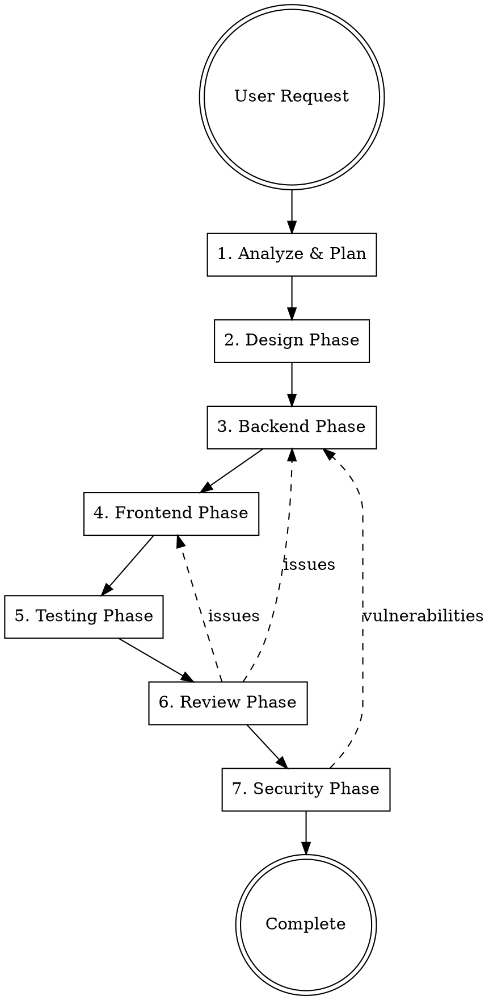

# Feature Build Orchestrator

Coordinate specialized agents to build complete features from a single request.

**Announce:** "I'm using the build-feature orchestrator to coordinate development of this feature."

## The Pipeline



## Phase Details

### 1. Analyze & Plan

Before dispatching agents, understand the request:

- What exactly is being built?
- Which platforms? (web-only, mobile-only, both)
- What API endpoints are needed?
- What data models are involved?
- What's the scope? (single page, multi-page flow, full feature)

Create TodoWrite with all phases and tasks.

### 2. Design Phase

**Dispatch:** `frontend-designer` agent

Input:

- Feature description
- User flows
- Data requirements
- Platform targets

Output:

- Component hierarchy
- UI specifications
- **Responsive behavior for ALL breakpoints:**
  - Small phone (<380px) - iPhone SE
  - Large phone (380-768px) - iPhone 15
  - Tablet/Desktop (≥768px)
- Accessibility requirements
- Translation keys for ALL user-facing text

### 3. Backend Phase

**Dispatch:** `backend-developer` agent

Input:

- Feature requirements
- Data models needed
- Design specifications (for API shape)

Output:

- oRPC contracts in `packages/core-contract/src/contracts/`
- Route handlers in `apps/api/src/orpc-routes/{public,private,admin}/`
- Action classes in `apps/api/src/actions/`
- Database schema in `packages/database/src/schema/tables/` if needed

### 4. Frontend Phase

**Dispatch in parallel:** `web-developer` and `mobile-developer` agents

Input:

- Design specifications (including responsive breakpoints)
- API contracts (from backend phase)
- Shared component requirements
- Translation keys for all text

Output:

- Shared UI in `packages/ui/src/screens/private/` with:
  - Responsive design using `useWindowDimensions`
  - ALL text using `useTranslation()`
  - Error handling using `@app/components` ErrorStates (NetworkError, GeneralError, EmptyState)
  - Props for platform-specific callbacks (signOut, etc.)
- Shared hooks in `packages/ui/src/hooks/`
- Web routes in `apps/web/src/app/(private)/` (thin wrappers)
- Mobile routes in `apps/mobile/src/app/(private)/` with:
  - Platform-specific auth functions passed (signOut from `@app/auth/client/native`)
- Translations in `packages/i18n/src/locales/{en,es}/`

### 5. Testing Phase

**Dispatch:** `test-engineer` agent

Input:

- All implemented code
- API contracts
- Expected behaviors

Output:

- API integration tests
- Component tests
- E2E test scenarios

### 6. Review Phase

**Dispatch:** `code-reviewer` agent

Input:

- All changes from previous phases
- Original requirements

Output:

- Code quality assessment
- Pattern compliance check
- Performance concerns
- Required fixes

### 7. Security Phase

**Dispatch:** `security-reviewer` agent

Input:

- All changes
- API endpoints
- Auth requirements

Output:

- Security assessment
- Vulnerability report
- Required mitigations

## Agent Dispatch Template

When dispatching each agent, provide:

```markdown
## Context

[Feature description and requirements]

## Your Task

[Specific deliverables for this agent]

## Codebase Context

- Monorepo: Turborepo + pnpm
- Web: Next.js 15, App Router
- Mobile: Expo 54, Expo Router
- API: Fastify 5 + oRPC
- Database: Drizzle + PostgreSQL
- Styling: Tailwind + NativeWind
- Auth: Better Auth
- State: TanStack Query + Zustand

## Files to Reference

[List relevant existing files]

## Constraints

[Any limitations or requirements]

## Output Format

[What files to create/modify]
```

## Coordination Rules

1. **Sequential by default** - Each phase completes before the next starts
2. **Parallel when possible** - Web and mobile can run in parallel after backend
3. **Review loops** - If reviewers find issues, dispatch fix agents
4. **Single source of truth** - Contracts define the API, all agents follow them
5. **Shared components first** - Build in `packages/ui` before platform-specific code
6. **Responsive by default** - ALL screens MUST use `useWindowDimensions` with breakpoints
7. **Platform-specific auth** - Mobile MUST pass native auth functions (signOut, etc.)
8. **i18n for ALL text** - Never hardcode user-facing strings

## Quick Builds

For simple features, skip unnecessary phases:

| Request Type     | Skip Phases                   |
| ---------------- | ----------------------------- |
| API-only         | Design, Frontend              |
| UI-only (no API) | Backend                       |
| Web-only         | Mobile                        |
| Mobile-only      | Web                           |
| Hotfix           | Design, Testing (manual test) |

## Example Orchestration

User: "Build a settings page where users can update their profile and notification preferences"

```
1. ANALYZE
   - Platforms: Web + Mobile
   - API: GET/PUT profile, GET/PUT notification prefs
   - Data: user profile fields, notification settings
   - Scope: Single screen with multiple sections

2. DESIGN (dispatch frontend-designer)
   → Component hierarchy, form layouts, validation UX

3. BACKEND (dispatch backend-developer)
   → Add settings contracts, routes, actions

4. FRONTEND (dispatch web-developer + mobile-developer in parallel)
   → Shared SettingsScreen in packages/ui
   → Web route at /settings
   → Mobile route at /(app)/settings

5. TESTING (dispatch test-engineer)
   → API tests for settings endpoints
   → Component tests for form validation

6. REVIEW (dispatch code-reviewer)
   → Check patterns, performance, accessibility

7. SECURITY (dispatch security-reviewer)
   → Verify auth on endpoints, input sanitization
```

## Handoff Protocol

Each agent must:

1. Read the previous agent's output
2. Validate assumptions still hold
3. Document what they built
4. List any blockers or questions
5. Provide clear handoff notes for next agent

## Red Flags

**Never:**

- Skip the planning phase
- Dispatch agents without clear requirements
- Let agents make conflicting decisions
- Skip security review for auth-related features
- Deploy without at least manual testing
- **Build non-responsive screens** - ALL screens must work on ALL device sizes
- **Hardcode user-facing text** - ALL text must use i18n
- **Omit platform-specific auth handling** - Mobile must pass native signOut
- **Skip small screen testing** - Test on iPhone SE (375px), not just large phones
- **Allow `any` types** - All code must be properly typed
- **Accept `@ts-nocheck`** - Fix the types instead of bypassing
- **Skip typecheck** - `pnpm typecheck` must pass before handoff

## Type Safety Gate

Before marking ANY phase complete, verify:

```bash
pnpm typecheck
```

If typecheck fails, the phase is NOT complete. Fix all type errors before proceeding.

### Common Type Issues by Phase

| Phase    | Common Issues      | Fix                                |
| -------- | ------------------ | ---------------------------------- |
| Backend  | `catch (err: any)` | Use `catch (err: unknown)`         |
| Backend  | Untyped DB queries | Add explicit select/return types   |
| Frontend | Form field `any`   | Define minimal FormField interface |
| Frontend | Component refs     | Use `@ts-expect-error` with reason |
| Testing  | Untyped mocks      | Match actual interface types       |
