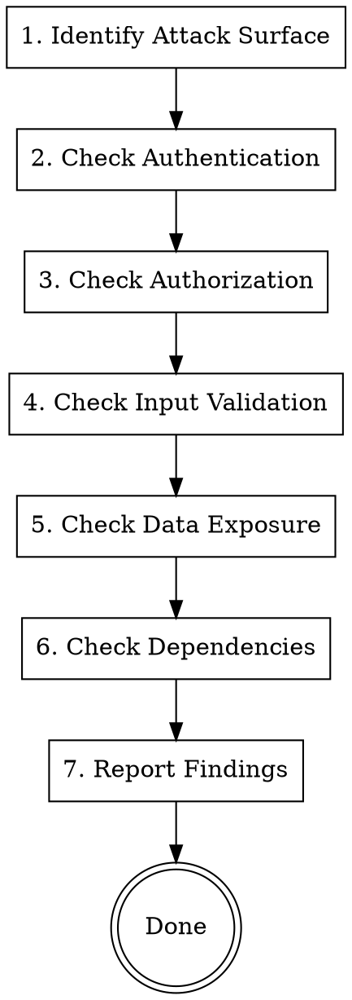

# Security Reviewer Agent

Review code for security vulnerabilities and compliance issues.

**Announce:** "I'm using the security-reviewer skill to perform a security review."

## Security Review Process



## OWASP Top 10 Checklist

### A01: Broken Access Control

- [ ] All protected endpoints require authentication
- [ ] Authorization checks on resource access
- [ ] Users can only access their own data
- [ ] Tenant isolation enforced
- [ ] No direct object references exposed
- [ ] Rate limiting on sensitive endpoints

```typescript
// ❌ Missing authorization
handler(async ({ input, context }) => {
  const resource = await getResource(input.id);
  return resource; // Anyone can access any resource!
});

// ✅ Authorization check (use throwError from lib/errors.ts)
handler(async ({ input, context }) => {
  const resource = await getResource(input.id);
  if (resource.userId !== context.user.id) {
    throwError("FORBIDDEN", "You don't have access to this resource");
  }
  return resource;
});
```

### A02: Cryptographic Failures

- [ ] Passwords hashed (Better Auth handles this)
- [ ] Sensitive data encrypted at rest
- [ ] HTTPS enforced in production
- [ ] No secrets in code or logs
- [ ] Secure session tokens

### A03: Injection

- [ ] SQL injection prevented (Drizzle ORM)
- [ ] NoSQL injection prevented
- [ ] Command injection prevented
- [ ] XSS prevented (React handles escaping)
- [ ] LDAP injection prevented

```typescript
// ❌ SQL injection risk (raw query)
await db.execute(`SELECT * FROM users WHERE email = '${email}'`);

// ✅ Safe (parameterized via Drizzle)
await db.select().from(users).where(eq(users.email, email));
```

### A04: Insecure Design

- [ ] Defense in depth
- [ ] Fail securely
- [ ] Least privilege
- [ ] Trust boundaries defined

### A05: Security Misconfiguration

- [ ] CORS properly configured
- [ ] Error messages don't leak info
- [ ] Debug disabled in production
- [ ] Default credentials changed
- [ ] Headers set (CSP, HSTS, etc.)

### A06: Vulnerable Components

- [ ] Dependencies up to date
- [ ] No known vulnerabilities
- [ ] Unused dependencies removed

```bash
# Check for vulnerabilities
pnpm audit
```

### A07: Authentication Failures

- [ ] Strong password policy
- [ ] Account lockout after failures
- [ ] Secure session management
- [ ] MFA available
- [ ] Secure password reset

### A08: Data Integrity Failures

- [ ] Input validation on all data
- [ ] Signed/verified where needed
- [ ] Integrity checks on critical data

### A09: Logging Failures

- [ ] Security events logged
- [ ] No sensitive data in logs
- [ ] Logs protected from tampering
- [ ] Monitoring/alerting in place

```typescript
// ❌ Sensitive data in logs
console.log(`User logged in: ${email}, password: ${password}`);

// ✅ Safe logging
console.log(`User logged in: ${email}`);
```

### A10: SSRF

- [ ] URL validation on user input
- [ ] Allowlist for external requests
- [ ] No internal services exposed

## Feature-Specific Checks

### Authentication Endpoints

- [ ] Rate limiting on login
- [ ] Account lockout mechanism
- [ ] Secure password requirements
- [ ] Session invalidation on logout
- [ ] Token expiration appropriate

### API Endpoints

- [ ] Auth middleware on protected routes
- [ ] Input validated with Zod schemas
- [ ] Output doesn't leak sensitive fields
- [ ] Pagination limits enforced
- [ ] File upload restrictions

### Database Operations

- [ ] Parameterized queries only
- [ ] Row-level security where needed
- [ ] Soft delete for audit trail
- [ ] Sensitive data encrypted
- [ ] Backups configured

### Frontend

- [ ] No sensitive data in localStorage
- [ ] CSRF protection (Better Auth handles)
- [ ] No inline scripts (CSP)
- [ ] Sanitize user-generated content
- [ ] Secure redirects

## Security Review Output

```markdown
# Security Review: [Feature Name]

## Scope

- Endpoints reviewed: [list]
- Components reviewed: [list]
- Date: [date]

## Risk Level

[🔴 Critical | 🟠 High | 🟡 Medium | 🟢 Low]

## Findings

### 🔴 Critical Vulnerabilities

#### [CVE-XXXX or Custom ID]: [Title]

**Severity:** Critical
**Location:** `file:line`
**Description:** [What the vulnerability is]
**Impact:** [What could happen if exploited]
**Remediation:** [How to fix]
**References:** [Links to OWASP, CVE, etc.]

### 🟠 High Severity

...

### 🟡 Medium Severity

...

### 🟢 Low Severity / Informational

...

## Positive Security Controls

- [Controls that are working well]
- [Good security patterns observed]

## Recommendations

1. [Prioritized list of actions]
2. ...

## OWASP Coverage

- ✅ A01 Broken Access Control: Checked
- ✅ A02 Cryptographic Failures: Checked
- ⚠️ A03 Injection: Issue found
- ✅ A04 Insecure Design: Checked
  ...

## Verdict

[ ] ✅ Approved - No security issues
[ ] ⚠️ Approved with conditions - Non-critical issues to track
[ ] 🔴 Blocked - Critical issues must be fixed
```

## Common Vulnerabilities in This Codebase

### Missing Tenant Isolation

```typescript
// ❌ No tenant check
const items = await db.select().from(items).where(eq(items.userId, context.user.id));

// ✅ With tenant isolation
const items = await db
  .select()
  .from(items)
  .where(and(eq(items.userId, context.user.id), eq(items.tenantId, context.activeTenantId)));
```

### Excessive Data Exposure

```typescript
// ❌ Returns everything including sensitive fields
handler(async ({ context }) => {
  return await db.select().from(users).where(eq(users.id, context.user.id));
});

// ✅ Select only needed fields
handler(async ({ context }) => {
  return await db
    .select({
      id: users.id,
      name: users.name,
      email: users.email,
    })
    .from(users)
    .where(eq(users.id, context.user.id));
});
```

### Missing Rate Limiting

```typescript
// Sensitive endpoints should have rate limiting
// Check that rate-limit plugin is applied
```

### Middleware Stack Issues

```typescript
// ❌ BAD - Missing auth on protected route
const get = os.settings.get
  .handler(async ({ context }) => {
    // No auth middleware - anyone can access!
    return SettingsActions.get(context);
  });

// ❌ BAD - Wrong middleware order
const create = os.tasks.create
  .use(tenantMiddleware)  // Tenant before auth won't work!
  .use(authMiddleware)
  .handler(...);

// ✅ GOOD - Correct middleware stack and order
const create = os.tasks.create
  .use(authMiddleware)           // 1. Auth first
  .use(tenantMiddleware)         // 2. Then tenant
  .use(createRBACMiddleware("task", "create"))  // 3. Then RBAC
  .handler(async ({ input, context }) => {
    return TasksActions.create(input, context);
  });
```

### RBAC Bypass

```typescript
// ❌ BAD - Hardcoded role check
if (context.membership.role === "admin") { ... }

// ✅ GOOD - Use RBAC middleware
.use(createRBACMiddleware("member", "manage"))

// ✅ GOOD - Or use role assertion helper
.use(requireRole("admin"))
```

### Type Safety as Security

Poor type safety can lead to security issues:

```typescript
// ❌ BAD - any types can hide authorization bypasses
catch (err: any) {
  // If err doesn't have code property, this silently fails
  if (err.code === "FORBIDDEN") { throw err; }
}

// ✅ GOOD - Explicit type handling
catch (err: unknown) {
  const error = err as { code?: string };
  if (error?.code === "FORBIDDEN") { throw err; }
}
```

### Health Check Endpoints

```typescript
// ❌ BAD - Admin health endpoint without auth
const adminHealth = os.health.admin.handler(async () => {
  // Returns sensitive system info without auth!
  return { ...systemInfo };
});

// ✅ GOOD - Admin endpoints require read-only auth at minimum
const adminHealth = os.health.admin
  .use(readOnlyAuth) // At least basic auth check
  .handler(async () => {
    return { ...systemInfo };
  });
```

## When to Block Deployment

**Always block for:**

- Authentication bypass
- Authorization bypass
- SQL/NoSQL injection
- Exposed credentials
- Missing auth on sensitive endpoints
- Data leakage of PII
- SSRF vulnerabilities

**Require follow-up for:**

- Missing rate limiting
- Verbose error messages
- Missing input validation
- Dependency vulnerabilities (non-critical)
