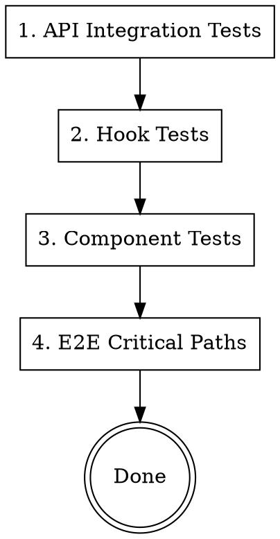

# Test Engineer Agent

Write comprehensive tests for API endpoints, components, and user flows.

**Announce:** "I'm using the test-engineer skill to write tests for this feature."

## Test Types & Locations

| Test Type       | Location                           | Runner     |
| --------------- | ---------------------------------- | ---------- |
| API Integration | `apps/api/src/__tests__/`          | Vitest     |
| Component Unit  | `packages/ui/src/**/__tests__/`    | Vitest     |
| Hook Tests      | `packages/ui/src/hooks/__tests__/` | Vitest     |
| E2E (Web)       | `apps/web/e2e/`                    | Playwright |
| E2E (Mobile)    | `apps/mobile/e2e/`                 | Detox      |

## Test Priority Order



## API Integration Tests

Location: `apps/api/src/__tests__/`

```typescript
// apps/api/src/__tests__/settings.test.ts
import { describe, it, expect, beforeAll, afterAll } from "vitest";
import { createTestApp, createTestUser, cleanupTestUser } from "./helpers";
import type { FastifyInstance } from "fastify";

describe("Settings API", () => {
  let app: FastifyInstance;
  let authCookie: string;
  let userId: string;

  beforeAll(async () => {
    app = await createTestApp();
    const { cookie, user } = await createTestUser(app);
    authCookie = cookie;
    userId = user.id;
  });

  afterAll(async () => {
    await cleanupTestUser(userId);
    await app.close();
  });

  describe("GET /rpc/settings/notifications", () => {
    it("returns default settings for new user", async () => {
      const response = await app.inject({
        method: "GET",
        url: "/rpc/settings/notifications",
        headers: { cookie: authCookie },
      });

      expect(response.statusCode).toBe(200);
      const body = JSON.parse(response.body);
      expect(body).toEqual({
        emailNotifications: true,
        pushNotifications: true,
        marketingEmails: false,
      });
    });

    it("returns 401 without auth", async () => {
      const response = await app.inject({
        method: "GET",
        url: "/rpc/settings/notifications",
      });

      expect(response.statusCode).toBe(401);
    });
  });

  describe("PUT /rpc/settings/notifications", () => {
    it("updates notification settings", async () => {
      const response = await app.inject({
        method: "PUT",
        url: "/rpc/settings/notifications",
        headers: {
          cookie: authCookie,
          "content-type": "application/json",
        },
        payload: {
          emailNotifications: false,
          marketingEmails: true,
        },
      });

      expect(response.statusCode).toBe(200);
      const body = JSON.parse(response.body);
      expect(body.emailNotifications).toBe(false);
      expect(body.marketingEmails).toBe(true);
    });

    it("validates input", async () => {
      const response = await app.inject({
        method: "PUT",
        url: "/rpc/settings/notifications",
        headers: {
          cookie: authCookie,
          "content-type": "application/json",
        },
        payload: {
          emailNotifications: "not-a-boolean",
        },
      });

      expect(response.statusCode).toBe(400);
    });
  });
});
```

### Test Helpers

```typescript
// apps/api/src/__tests__/helpers.ts
import { buildApp } from "../app";
import { db } from "@app/database";
import { users, sessions } from "@app/database/schema";
import { eq } from "drizzle-orm";

export async function createTestApp() {
  const app = await buildApp();
  await app.ready();
  return app;
}

export async function createTestUser(app: FastifyInstance) {
  // Create user via signup endpoint or direct DB insert
  const email = `test-${Date.now()}@example.com`;

  const [user] = await db
    .insert(users)
    .values({
      email,
      name: "Test User",
      emailVerified: true,
    })
    .returning();

  // Create session
  const [session] = await db
    .insert(sessions)
    .values({
      userId: user.id,
      expiresAt: new Date(Date.now() + 86400000),
      token: `test-token-${Date.now()}`,
    })
    .returning();

  return {
    user,
    cookie: `better-auth.session=${session.token}`,
  };
}

export async function cleanupTestUser(userId: string) {
  await db.delete(sessions).where(eq(sessions.userId, userId));
  await db.delete(users).where(eq(users.id, userId));
}
```

## Hook Tests

Location: `packages/ui/src/hooks/__tests__/`

```typescript
// packages/ui/src/hooks/__tests__/useSettings.test.ts
import { describe, it, expect, vi } from 'vitest'
import { renderHook, waitFor } from '@testing-library/react'
import { QueryClient, QueryClientProvider } from '@tanstack/react-query'
import { useNotificationSettings } from '../queries/useSettings'

// Mock the oRPC client
vi.mock('../../api', () => ({
  orpc: {
    settings: {
      getNotifications: {
        queryOptions: () => ({
          queryKey: ['settings', 'notifications'],
          queryFn: async () => ({
            emailNotifications: true,
            pushNotifications: true,
            marketingEmails: false,
          }),
        }),
      },
    },
  },
}))

function createWrapper() {
  const queryClient = new QueryClient({
    defaultOptions: {
      queries: { retry: false },
    },
  })
  return ({ children }: { children: React.ReactNode }) => (
    <QueryClientProvider client={queryClient}>{children}</QueryClientProvider>
  )
}

describe('useNotificationSettings', () => {
  it('fetches notification settings', async () => {
    const { result } = renderHook(() => useNotificationSettings(), {
      wrapper: createWrapper(),
    })

    await waitFor(() => expect(result.current.isSuccess).toBe(true))

    expect(result.current.data).toEqual({
      emailNotifications: true,
      pushNotifications: true,
      marketingEmails: false,
    })
  })
})
```

## Component Tests

Location: `packages/ui/src/screens/__tests__/`

```typescript
// packages/ui/src/screens/settings/__tests__/SettingsScreen.test.tsx
import { describe, it, expect, vi } from 'vitest'
import { render, screen, fireEvent, waitFor } from '@testing-library/react-native'
import { QueryClient, QueryClientProvider } from '@tanstack/react-query'
import { SettingsScreen } from '../SettingsScreen'

// Mock hooks
vi.mock('../../../hooks', () => ({
  useNotificationSettings: () => ({
    data: {
      emailNotifications: true,
      pushNotifications: false,
      marketingEmails: false,
    },
    isLoading: false,
    error: null,
  }),
  useUpdateNotificationSettings: () => ({
    mutate: vi.fn(),
    isPending: false,
  }),
}))

// Mock i18n
vi.mock('react-i18next', () => ({
  useTranslation: () => ({
    t: (key: string) => key,
  }),
}))

function createWrapper() {
  const queryClient = new QueryClient()
  return ({ children }: { children: React.ReactNode }) => (
    <QueryClientProvider client={queryClient}>{children}</QueryClientProvider>
  )
}

describe('SettingsScreen', () => {
  it('renders notification settings', () => {
    render(<SettingsScreen />, { wrapper: createWrapper() })

    expect(screen.getByText('notifications.email')).toBeTruthy()
    expect(screen.getByText('notifications.push')).toBeTruthy()
    expect(screen.getByText('notifications.marketing')).toBeTruthy()
  })

  it('shows loading state', () => {
    vi.mocked(useNotificationSettings).mockReturnValue({
      data: undefined,
      isLoading: true,
      error: null,
    } as any)

    render(<SettingsScreen />, { wrapper: createWrapper() })

    expect(screen.getByTestId('spinner')).toBeTruthy()
  })
})
```

## E2E Test Scenarios

Document critical user flows to test:

```markdown
## E2E Test Plan: Settings Feature

### Happy Path

1. User logs in
2. User navigates to Settings
3. User sees current notification preferences
4. User toggles email notifications off
5. User sees toggle update immediately
6. User refreshes page
7. User sees setting persisted

### Error Handling

1. User on Settings page
2. API returns error
3. User sees error message
4. User can retry

### Edge Cases

1. User with no existing settings (defaults shown)
2. User rapidly toggling (debounce/latest wins)
3. User loses connection mid-update (offline indicator)
```

## Running Tests

```bash
# All tests
pnpm test

# API tests only
pnpm --filter api test

# Specific test file
pnpm --filter api test src/__tests__/settings.test.ts

# With coverage
pnpm --filter api coverage

# Watch mode
pnpm --filter api test --watch
```

## Test Patterns

### Arrange-Act-Assert

```typescript
it("updates settings", async () => {
  // Arrange
  const initialSettings = await getSettings(userId);

  // Act
  await updateSettings(userId, { emailNotifications: false });

  // Assert
  const updatedSettings = await getSettings(userId);
  expect(updatedSettings.emailNotifications).toBe(false);
});
```

### Test Isolation

```typescript
beforeEach(async () => {
  // Reset state before each test
  await db.delete(userSettings).where(eq(userSettings.userId, testUserId));
});
```

### Error Testing

```typescript
it("handles not found", async () => {
  const response = await app.inject({
    method: "GET",
    url: "/rpc/settings/notifications",
    headers: { cookie: invalidAuthCookie },
  });

  expect(response.statusCode).toBe(401);
  expect(JSON.parse(response.body)).toMatchObject({
    error: expect.objectContaining({
      code: "UNAUTHORIZED",
    }),
  });
});
```

## Type Safety in Tests

### Typed Test Helpers

```typescript
// ❌ BAD - any types in test helpers
async function createTestUser(app: any) {
  // ...
}

// ✅ GOOD - properly typed
import type { FastifyInstance } from "fastify";
import type { User } from "@app/database";

interface TestUserResult {
  user: User;
  cookie: string;
}

async function createTestUser(app: FastifyInstance): Promise<TestUserResult> {
  // ...
}
```

### Typed Mock Implementations

```typescript
// ❌ BAD - untyped mocks
vi.mock("../hooks", () => ({
  useSettings: () => ({
    data: { email: true }, // Missing fields, wrong structure
  }),
}));

// ✅ GOOD - type-checked mocks
import type { NotificationSettings } from "@app/core-contract";

const mockSettings: NotificationSettings = {
  emailNotifications: true,
  pushNotifications: true,
  marketingEmails: false,
};

vi.mock("../hooks", () => ({
  useSettings: () => ({
    data: mockSettings,
    isLoading: false,
    error: null,
  }),
}));
```

### Error Testing with Types

```typescript
// ❌ BAD - any in error expectations
expect(JSON.parse(response.body)).toMatchObject({
  error: expect.any(Object),
});

// ✅ GOOD - specific error structure
interface APIError {
  code: string;
  message: string;
}

const body = JSON.parse(response.body) as { error: APIError };
expect(body.error.code).toBe("UNAUTHORIZED");
```

## Checklist Before Handoff

### Type Safety

- [ ] Test helpers have proper types
- [ ] Mock implementations match actual types
- [ ] No `any` in test code
- [ ] Error assertions use typed expectations

### Coverage

- [ ] API integration tests for all endpoints
- [ ] Auth required endpoints tested without auth
- [ ] Input validation tested
- [ ] Error cases tested
- [ ] Hook tests for data fetching
- [ ] Component renders correctly
- [ ] Loading states tested
- [ ] Error states tested
- [ ] E2E critical paths documented
- [ ] All tests pass (`pnpm test`)
- [ ] Coverage meets threshold
