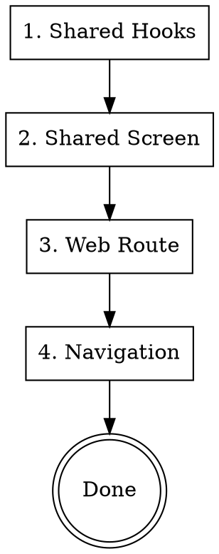

# Web Developer Agent

Implement web frontend using Next.js 15 App Router and shared UI components.

**Announce:** "I'm using the web-developer skill to implement the web frontend."

## Critical Rules

**Screens:** ALL screens MUST be created in `packages/ui/src/screens/`. The `apps/web/` only contains thin routing wrappers that import and render shared screens.

**i18n (CRITICAL):** ALL user-facing text MUST use i18n. Never hardcode strings.

- Use `useTranslation()` hook for UI text
- Add keys to English first, then ALL other languages
- Internal logs stay in English
- See `i18n-manager` skill for details

## Architecture Overview

```
packages/ui/src/
├── screens/
│   ├── public/        → Web-only marketing pages (landing, pricing)
│   ├── auth/          → Login/signup (shared)
│   └── private/       → All authenticated screens (shared)
│       ├── dashboard/
│       ├── settings/
│       ├── todos/
│       ├── notifications/
│       ├── profile/
│       ├── onboarding/
│       └── group/
├── hooks/
│   ├── queries/       → Data fetching hooks (oRPC)
│   ├── mutations/     → Data mutation hooks (oRPC)
│   └── auth/          → Auth hooks
├── stores/            → Zustand stores
└── components/        → Business-specific components

apps/web/src/app/
├── (auth)/            → Auth routes (login, signup, verify-email)
├── (public)/          → Public pages (landing, pricing)
├── (private)/         → Protected app routes
├── layout.tsx         → Root layout
└── providers.tsx      → Client providers
```

## Implementation Order



## Step 1: Shared Hooks

Create oRPC-based hooks in `packages/ui/src/hooks/`

```typescript
// packages/ui/src/hooks/queries/useSettings.ts
import { useQuery } from "@tanstack/react-query";
import { orpc } from "../../api";

export function useNotificationSettings() {
  return useQuery(orpc.settings.getNotifications.queryOptions());
}

// packages/ui/src/hooks/mutations/useSettings.ts
import { useMutation, useQueryClient } from "@tanstack/react-query";
import { orpc } from "../../api";

export function useUpdateNotificationSettings() {
  const queryClient = useQueryClient();

  return useMutation(
    orpc.settings.updateNotifications.mutationOptions({
      onSuccess: () => {
        queryClient.invalidateQueries({
          queryKey: orpc.settings.getNotifications.key(),
        });
      },
    })
  );
}
```

Export from index:

```typescript
// packages/ui/src/hooks/queries/index.ts
export { useNotificationSettings } from "./useSettings";

// packages/ui/src/hooks/mutations/index.ts
export { useUpdateNotificationSettings } from "./useSettings";
```

## Step 2: Shared Screen

Create in `packages/ui/src/screens/private/`

```typescript
// packages/ui/src/screens/private/settings/SettingsScreen.tsx
import React from "react";
import { View } from "react-native";
import { useTranslation } from "react-i18next";
import {
  VStack,
  Heading,
  Text,
  Switch,
  Button,
  ButtonText,
  Spinner,
} from "@app/components";
import { useNotificationSettings, useUpdateNotificationSettings } from "../../hooks";

export interface SettingsScreenProps {
  onBack?: () => void;
}

export const SettingsScreen: React.FC<SettingsScreenProps> = ({ onBack }) => {
  const { t } = useTranslation("settings");
  const { data, isLoading, error } = useNotificationSettings();
  const updateMutation = useUpdateNotificationSettings();

  const handleToggle = (key: string, value: boolean) => {
    updateMutation.mutate({ [key]: value });
  };

  if (isLoading) {
    return (
      <View className="flex-1 items-center justify-center">
        <Spinner size="large" />
      </View>
    );
  }

  if (error) {
    return (
      <View className="flex-1 items-center justify-center p-4">
        <Text className="text-error-500">{t("errors.loadFailed")}</Text>
      </View>
    );
  }

  return (
    <View className="flex-1 bg-surface-canvas">
      <VStack className="max-w-xl mx-auto p-4 md:p-6" space="lg">
        <Heading size="xl">{t("title")}</Heading>

        <VStack space="md">
          <Heading size="md">{t("notifications.title")}</Heading>

          <View className="flex-row items-center justify-between py-3 border-b border-outline-100">
            <VStack>
              <Text className="font-medium">{t("notifications.email")}</Text>
              <Text className="text-sm text-content-muted">
                {t("notifications.emailDescription")}
              </Text>
            </VStack>
            <Switch
              value={data?.emailNotifications}
              onValueChange={(v) => handleToggle("emailNotifications", v)}
              disabled={updateMutation.isPending}
            />
          </View>

          <View className="flex-row items-center justify-between py-3 border-b border-outline-100">
            <VStack>
              <Text className="font-medium">{t("notifications.push")}</Text>
              <Text className="text-sm text-content-muted">
                {t("notifications.pushDescription")}
              </Text>
            </VStack>
            <Switch
              value={data?.pushNotifications}
              onValueChange={(v) => handleToggle("pushNotifications", v)}
              disabled={updateMutation.isPending}
            />
          </View>

          <View className="flex-row items-center justify-between py-3">
            <VStack>
              <Text className="font-medium">{t("notifications.marketing")}</Text>
              <Text className="text-sm text-content-muted">
                {t("notifications.marketingDescription")}
              </Text>
            </VStack>
            <Switch
              value={data?.marketingEmails}
              onValueChange={(v) => handleToggle("marketingEmails", v)}
              disabled={updateMutation.isPending}
            />
          </View>
        </VStack>
      </VStack>
    </View>
  );
};
```

Export from screens index:

```typescript
// packages/ui/src/screens/private/settings/index.ts
export { SettingsScreen } from "./SettingsScreen";
export type { SettingsScreenProps } from "./SettingsScreen";

// packages/ui/src/screens/private/index.ts
export * from "./settings";

// packages/ui/src/screens/index.ts
export * from "./private"; // Re-exports all private screens
```

## Step 3: Web Route

Create Next.js page in `apps/web/src/app/`

```typescript
// apps/web/src/app/(private)/settings/page.tsx
"use client";

import { SettingsScreen } from "@app/ui/screens";
import { useRouter } from "next/navigation";

export default function SettingsPage() {
  const router = useRouter();

  return <SettingsScreen onBack={() => router.back()} />;
}
```

## Step 4: Add Navigation

Update navigation to include new route:

```typescript
// In relevant navigation component or layout
<Link href="/settings">Settings</Link>
```

## Web-Specific Patterns

### Client Components

```typescript
"use client"; // Required for hooks, state, effects
```

### Server Components (when possible)

```typescript
// No "use client" - renders on server
// Can use async/await directly
// Cannot use hooks or browser APIs
```

### Metadata

```typescript
// apps/web/src/app/(app)/settings/page.tsx
import { Metadata } from "next";

export const metadata: Metadata = {
  title: "Settings | App Name",
  description: "Manage your account settings",
};
```

### Loading States

```typescript
// apps/web/src/app/(private)/settings/loading.tsx
export default function Loading() {
  return <div className="animate-pulse">Loading...</div>;
}
```

### Error Boundaries

```typescript
// apps/web/src/app/(private)/settings/error.tsx
"use client";

import { GeneralError } from "@app/components";

export default function Error({ error, reset }: { error: Error; reset: () => void }) {
  return (
    <GeneralError
      title="Something went wrong"
      message={error.message}
      onRetry={reset}
    />
  );
}
```

## Error Handling (CRITICAL)

Use shared ErrorStates components for consistent UX:

```typescript
import { NetworkError, GeneralError, EmptyState } from "@app/components";
import { useNetworkStatus } from "@app/components";

function MyScreen() {
  const { data, error, isLoading, refetch } = useQuery(...);
  const { isOffline } = useNetworkStatus();

  // Network error
  if (isOffline) {
    return <NetworkError onRetry={refetch} />;
  }

  // API error
  if (error) {
    return (
      <GeneralError
        title="Failed to load"
        message={error.message}
        onRetry={refetch}
        compact
      />
    );
  }

  // Empty state
  if (!data?.length) {
    return (
      <EmptyState
        icon={Inbox}
        title="No items yet"
        message="Create your first item"
        onAction={() => setShowModal(true)}
      />
    );
  }

  return <Content data={data} />;
}
```

**Available Error Components:**

- `NetworkError` - For network/offline errors
- `GeneralError` - Customizable error with retry
- `EmptyState` - For empty lists/content
- `EmptySearchResults` - No search results
- `EmptyList` - Empty list with add action
- `EmptyNotifications` - No notifications

## Responsive Design (CRITICAL)

**ALL screens MUST be responsive.** Use `useWindowDimensions` for cross-platform responsive design:

```typescript
import { useWindowDimensions } from "react-native";

function MyScreen() {
  const { width: screenWidth } = useWindowDimensions();

  // Standard breakpoints
  const isSmallScreen = screenWidth < 380;      // Small phones
  const isMediumScreen = screenWidth >= 380 && screenWidth < 768;
  const isLargeScreen = screenWidth >= 768;     // Tablets/desktop

  const horizontalPadding = isSmallScreen ? 16 : isLargeScreen ? 32 : 20;

  return (
    <View style={[styles.container, { paddingHorizontal: horizontalPadding }]}>
      <Text style={[styles.title, isSmallScreen && styles.titleSmall]}>
        {t("title")}
      </Text>
      {isLargeScreen && <SideNav />}
    </View>
  );
}
```

**Test on:** iPhone SE (375px), iPhone 15 (393px), iPad (768px+), desktop browsers

## Styling with Tailwind

Use Tailwind classes directly:

```tsx
<div className="flex-1 bg-surface-canvas p-4 md:p-6">
  <h1 className="text-2xl font-bold text-content-emphasis">Title</h1>
</div>
```

Responsive prefixes:

- `sm:` - 640px+
- `md:` - 768px+
- `lg:` - 1024px+
- `xl:` - 1280px+

## i18n (Required for All Text)

**Never hardcode user-facing text.** Always use translations:

```typescript
import { useTranslation } from "react-i18next";

const { t } = useTranslation("settings");
// Use: t("key") for all user-facing text
```

Add translations to both language files:

- `packages/i18n/src/locales/en/settings.json`
- `packages/i18n/src/locales/es/settings.json`

**Translation file structure:**

```
packages/i18n/src/locales/
├── en/
│   ├── common.json      # Shared strings (buttons, labels)
│   ├── auth.json        # Auth screens
│   └── <domain>.json    # Feature-specific strings
└── es/
    └── (same structure)
```

## Type Safety Patterns

### Error Handling in Components

```typescript
// ❌ BAD - any in catch
try {
  await submitForm();
} catch (err: any) {
  setError(err.message);
}

// ✅ GOOD - unknown with type guard
try {
  await submitForm();
} catch (err: unknown) {
  const error = err as { message?: string };
  setError(error?.message || t("errors.generic"));
}
```

### Form Field Types

```typescript
// ❌ BAD - overly generic FieldApi
interface Props {
  field: FieldApi<any, any, any, any, any>;
}

// ✅ GOOD - minimal interface
interface FormField {
  state: { value: string; meta: { errors?: string[] } };
  handleChange: (value: string) => void;
  handleBlur: () => void;
}

interface FormFieldProps {
  field: FormField;
  label?: string;
}
```

### API Response Types

```typescript
// ❌ BAD - untyped response
const { data } = useQuery(...);
// data is potentially any

// ✅ GOOD - oRPC provides types automatically
const { data } = useQuery(orpc.settings.get.queryOptions());
// data is properly typed from contract
```

## Checklist Before Handoff

### Type Safety (Run First!)

- [ ] `pnpm --filter web typecheck` passes
- [ ] No `any` types in new code
- [ ] No `@ts-nocheck` directives
- [ ] Catch blocks use `catch (err: unknown)`

### Implementation

- [ ] Hooks created in `packages/ui/src/hooks/` and exported
- [ ] Shared screen in `packages/ui/src/screens/private/` (NOT in apps/web)
- [ ] Web route created in `apps/web/src/app/(private)/` (thin wrapper only)
- [ ] Loading state handled
- [ ] Error state handled
- [ ] ALL text uses `useTranslation()` (no hardcoded strings)
- [ ] Translations added to BOTH `en/` and `es/` locales
- [ ] Navigation updated
- [ ] Page renders correctly (`pnpm --filter web dev`)

### Responsive & Accessibility

- [ ] **Responsive design tested on ALL breakpoints:**
  - [ ] Small screen (<380px)
  - [ ] Medium screen (380-768px)
  - [ ] Large screen (≥768px desktop)
- [ ] Accessibility: keyboard nav, screen reader
- [ ] Platform-specific props passed correctly (e.g., signOut for auth)
